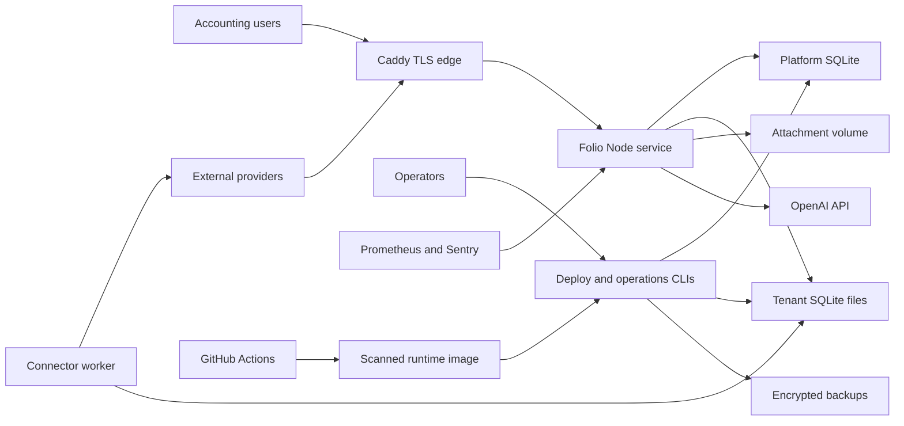

# Folio repository threat model

Review date: 2026-08-23  
Repository: `codex-ledger`  
Modeled branch: `main`

## Executive summary

Folio concentrates high-integrity accounting data, sensitive attachments, tenant identity, provider
credentials and automated posting behind one internet-facing Node process and a single-writer SQLite
deployment. The highest-risk themes are first-administrator bootstrap takeover, compromised sessions
or privileged insiders changing financial records, cross-tenant authorization failure, non-native
webhook authentication, and single-node/resource-exhaustion failure. Physical tenant databases,
server-side role checks, CSRF/origin defenses, immutable posted journals, secret references, bounded
request bodies, encrypted backups, one-time secret-file bootstrap authorization and container
hardening materially reduce risk, but production still requires a network-restricted bootstrap
ceremony, MFA/SSO, provider-native OAuth/webhook validation, live cloud controls, and independent
authenticated penetration testing.

## Scope and assumptions

In scope are the runtime server and browser client, authentication/control plane, tenant ledgers,
attachments, imports, provider synchronization/webhooks, AI drafting, operational CLIs, backup/restore,
Compose/Caddy/monitoring configuration, and CI image construction. Primary evidence is in `server.js`,
`lib/`, `scripts/`, `compose.production.yml`, `ops/`, and `.github/workflows/ci.yml`.

Assumptions used because deployment context was not confirmed:

- Folio will be an internet-accessible, multi-tenant SaaS using the documented single-node Caddy and
  Folio topology (`docs/production-operations.md`, “Topology and boundaries”).
- Tenant data may include financial records, bank/payroll data, business PII, tax identifiers and
  sensitive supporting documents. Cardholder data remains at Stripe and never enters Folio.
- Local email/password login is used initially; steady-state user creation is administrator/invite
  controlled. The first-admin endpoint is reachable only during an intentionally short bootstrap.
- Production secrets are supplied by a cloud secret manager as files, volumes are encrypted by the
  hosting platform, and TLS terminates only at Caddy (`compose.production.yml`, `ops/Caddyfile`).
- Live OAuth exchanges, provider-native webhook verification and provider sandbox certification are
  not yet deployed (`docs/integrations.md`).

Open questions that materially change ranking are whether launch is a private pilot or public SaaS,
whether payroll/tax identifiers and bank-account documents are stored, and whether bootstrap is
network-restricted or publicly reachable. A private pilot and lower-sensitivity dataset reduce
TM-001/TM-002/TM-009 likelihood; public bootstrap or regulated data increases them.

## System model

### Primary components

- Caddy is the public TLS edge, blocks `/metrics`, and proxies to the internal Folio service
  (`ops/Caddyfile`; `compose.production.yml`, services `caddy` and `folio`).
- `server.js` is a raw Node HTTP server serving the React bundle, session APIs, accounting APIs,
  downloads and unauthenticated signed webhook routes (`server.js`, `createFolioServer`, `apiRequest`,
  `webhook`).
- The platform SQLite database stores users, memberships, sessions, organization-to-database routing,
  idempotency records, AI history and webhook replay records (`lib/platform.js`,
  `PLATFORM_MIGRATIONS`).
- Every organization has a physically separate SQLite ledger and attachment namespace
  (`lib/db.js`, `createLedger`/`assertTenantBinding`; `lib/operations.js`, `addAttachment`).
- The connector worker resolves secret-manager references and calls fixed Plaid, Stripe, Gusto and
  HubSpot endpoints (`scripts/sync-integration.js`; `lib/provider-adapters.js`).
- Backup/restore CLIs package platform, tenant and attachment data with authenticated encryption and
  safe restore paths (`lib/backup.js`; `scripts/backup.js`; `scripts/restore.js`).
- Prometheus, Alertmanager and Sentry receive operational telemetry; CI builds and scans the production
  image (`ops/prometheus.yml`, `ops/alertmanager.yml`, `.github/workflows/ci.yml`).

### Data flows and trust boundaries

- Internet user → Caddy → Folio: credentials, cookies, CSRF tokens, JSON mutations, imports and files
  cross HTTPS then an internal Docker network. Caddy supplies TLS/HSTS; Folio enforces exact Origin,
  cookie sessions, CSRF, roles, JSON media type, body/time limits and security headers (`ops/Caddyfile`;
  `server.js`, `apiRequest`, `readJson`, `readBody`, `securityHeaders`).
- Folio → platform database: password hashes, sessions, tenant routing, idempotency, webhook and audit
  data cross local SQLite calls. Queries are prepared and first-admin creation is serialized
  (`lib/platform.js`, `setup`, `resolveSession`, `migratePlatform`).
- Folio → tenant database and attachment volume: accounting inputs, journals, PII and evidence cross
  in-process repository calls and filesystem writes. Tenant identity is checked before migrations;
  posted journals have database immutability triggers (`lib/db.js`, `assertTenantBinding`, `migrate`;
  `lib/operations.js`, `addAttachment`).
- Provider → webhook endpoint → durable queue → worker → tenant ledger: unauthenticated
  network payloads cross provider-native verification, connection/account binding, payload hashing,
  durable deduplication, leased delivery and tenant-transactional event application (`server.js`,
  `webhook`; `lib/webhook-worker.js`; `lib/webhook-application.js`).
- Connector worker → providers → tenant ledger: secret-backed credentials and cursors leave the trust
  boundary over HTTPS; responses are provider-specific schema parsed, normalized, hashed and staged
  with retry bounds (`lib/provider-adapters.js`, `runProviderSync`, `providerRequest`).
- Folio → OpenAI: a journal description and account catalog cross to a third party when the optional
  key is configured; the response is schema constrained and remains a human-dispositioned draft
  (`lib/ai.js`; `lib/platform.js`, `logAiProposal`).
- Operator → operational CLIs/volumes: migrations, privacy operations, backup and restore run with
  filesystem/database privileges. Preflight validates production configuration; operator identity is
  external to the application (`scripts/ops-preflight.js`, `scripts/migrate.js`, `lib/backup.js`).
- GitHub Actions → production image: source and dependencies cross a hosted CI boundary. Lockfile
  install, audit, tests, migration rehearsal, image build and high/critical Trivy scan gate output
  (`.github/workflows/ci.yml`).

#### Diagram

## Assets and security objectives

| Asset                                                  | Why it matters                                                                 | Security objective (C/I/A)  |
| ------------------------------------------------------ | ------------------------------------------------------------------------------ | --------------------------- |
| Tenant ledgers and subledgers                          | Source of financial statements, tax/accounting decisions and customer balances | C/I/A, especially integrity |
| Platform identity and tenant-routing data              | Controls every session and physical tenant database selection                  | C/I/A                       |
| Posted journals, hashes and audit history              | Evidence of authorized, immutable accounting activity                          | I/A                         |
| Attachments and import source files                    | May contain contracts, bank/payroll data, PII and audit evidence               | C/I/A                       |
| Provider, AI and backup credentials                    | Permit third-party access, data export or backup decryption                    | C/I                         |
| Integration cursors, payload hashes and replay records | Prevent missing, duplicated or substituted financial events                    | I/A                         |
| Backups and restore manifests                          | Determine recoverability and may contain the complete customer corpus          | C/I/A                       |
| Production image, migrations and configuration         | Define executable behavior and data compatibility                              | I/A                         |
| Accounting policies, validation packs and sign-offs    | Govern conclusions and reliance on generated statements                        | I/A                         |
| Availability and monitoring evidence                   | Single-node outage blocks close, billing and reconciliation work               | A/I                         |

## Attacker model

### Capabilities

- An unauthenticated internet attacker can reach Caddy, login, first-admin setup while uninitialized,
  static assets, health endpoints and provider webhook paths.
- A credentialed low-privilege tenant member can submit permitted JSON, imports and attachments and can
  probe object identifiers and resource limits.
- A malicious administrator, approver or compromised session can invoke the full permission set of
  that role; an administrator can create users and organizations.
- A compromised provider or stolen webhook/connector credential can send plausible financial events
  or return malicious/high-volume API data.
- A deployment operator or compromised CI identity may modify images, environment, volumes, secrets,
  migrations or backups.

### Non-capabilities

- A normal remote attacker is not assumed to possess host root, Docker socket, secret-manager or
  GitHub-administrator access, break modern TLS/cryptography, or directly open SQLite/volume files.
- Provider-native systems, cloud physical controls, user endpoints/browser extensions and upstream
  DDoS protection are not implemented in this repository and are not assumed compromised unless a
  threat explicitly says so.
- Accounting-source facts supplied by authorized users are not assumed correct; determining their
  economic truth is a controller/CPA control, not an application security capability.

## Entry points and attack surfaces

| Surface                       | How reached                | Trust boundary                      | Notes                                                                  | Evidence (repo path / symbol)                                              |
| ----------------------------- | -------------------------- | ----------------------------------- | ---------------------------------------------------------------------- | -------------------------------------------------------------------------- |
| Bootstrap and login           | Public HTTPS JSON          | Internet → identity plane           | First admin, password verification, lockout and cookies                | `server.js:apiRequest`; `lib/platform.js:setup/login`                      |
| Authenticated accounting APIs | Session cookie plus CSRF   | User → Folio → tenant ledger        | Broad mutation set with a fail-closed route/role manifest              | `lib/api-route-policies.js`; `server.js:apiRequest/api`                    |
| Webhooks                      | Public HTTPS POST          | Provider → queue → worker → ledger  | Provider signature, connection scope, event ID, lease and payload hash | `server.js:webhook`; `lib/webhook-worker.js`; `lib/webhook-application.js` |
| Imports and bank CSV          | Authenticated JSON         | Tenant operator → parsers/ledger    | Mapping, validation, dedupe and formula rejection                      | `lib/imports.js:stageImport`; `lib/operations.js:importBankStatement`      |
| Attachments/downloads         | Authenticated JSON and GET | User → filesystem                   | Base64 upload, type signatures, safe names and tenant directory        | `lib/operations.js:addAttachment/attachment`                               |
| Connector synchronization     | Operator/scheduler CLI     | Secrets/providers → worker → ledger | Fixed endpoints, schemas, cursors, retries and dead letters            | `scripts/sync-integration.js`; `lib/provider-adapters.js`                  |
| AI journal drafts             | Authenticated JSON         | User/tenant data → OpenAI           | Optional, quota limited, schema-constrained draft                      | `lib/ai.js:proposeJournal`; `lib/platform.js:aiQuota`                      |
| Reports and disclosures       | Authenticated GET          | Tenant ledger → browser/download    | High-value bulk financial output                                       | `server.js`, report route; `lib/reports.js:financialReport`                |
| Operations CLIs               | Host/operator execution    | Operator → all persistent data      | Migrate, backup, restore, privacy and integrity                        | `scripts/`                                                                 |
| Metrics, logs and errors      | Internal scrape/telemetry  | Runtime → operators/third parties   | Bounded route labels; potential metadata exposure                      | `server.js:metrics/log`; `ops/Caddyfile`                                   |
| CI and dependencies           | GitHub event               | Developer/GitHub → image            | Hosted runners and third-party actions                                 | `.github/workflows/ci.yml`                                                 |

## Top abuse paths

1. First-admin takeover: attacker discovers an uninitialized public deployment → submits valid setup
   before the operator → becomes administrator → creates users and accesses every newly created tenant.
2. Session-to-ledger fraud: attacker steals an approver/admin cookie → obtains or induces a CSRF token
   through same-origin access → posts plausible journals or changes policies → financial output is
   wrong while actions appear authorized.
3. Tenant-boundary probe: malicious member varies object IDs and organization hints → reaches a query
   or cached ledger path missing tenant scoping → reads another tenant's statements or attachments.
4. Webhook event injection: provider secret is stolen or shared too broadly → attacker signs a payload
   without a freshness timestamp → targets a tenant slug → records cash, invoices, payroll or expenses.
5. Connector integrity attack: provider/OAuth credential is compromised → attacker manipulates paged or
   stale data → cursor advances after incomplete input → Folio omits or duplicates accounting events.
6. Storage exhaustion: authenticated member repeatedly uploads allowed files/imports or creates
   high-cardinality accounting data → fills the single host volume or holds the SQLite writer → service
   and backups fail.
7. Insider override: administrator acts as maker and poster → creates a balanced but fraudulent entry,
   completes close evidence and locks the period → immutability preserves the fraud rather than
   preventing it.
8. Backup/restore substitution: operator or compromised backup store replaces manifest/data or uses a
   stale recovery set → restore succeeds into a new location but loses events → statements diverge
   unless reconciliation gates catch it.
9. Supply-chain insertion: compromised dependency/action or unprotected branch changes server/image →
   CI produces an apparently valid artifact → production secrets and financial data are exposed at
   runtime.
10. AI disclosure/manipulation: authorized user submits sensitive narrative or adversarial text → data
    crosses to the AI provider or proposal is misleading → user accepts an incorrect draft despite
    deterministic posting validation.

## Threat model table

| Threat ID | Threat source                                     | Prerequisites                                             | Threat action                                                                                          | Impact                                                         | Impacted assets                                   | Existing controls (evidence)                                                                                                                                                                                                                                                                                                                                                                                                                                                                                                                               | Gaps                                                                                                                                                                                    | Recommended mitigations                                                                                                                                               | Detection ideas                                                                                      | Likelihood                      | Impact severity | Priority |
| --------- | ------------------------------------------------- | --------------------------------------------------------- | ------------------------------------------------------------------------------------------------------ | -------------------------------------------------------------- | ------------------------------------------------- | ---------------------------------------------------------------------------------------------------------------------------------------------------------------------------------------------------------------------------------------------------------------------------------------------------------------------------------------------------------------------------------------------------------------------------------------------------------------------------------------------------------------------------------------------------------- | --------------------------------------------------------------------------------------------------------------------------------------------------------------------------------------- | --------------------------------------------------------------------------------------------------------------------------------------------------------------------- | ---------------------------------------------------------------------------------------------------- | ------------------------------- | --------------- | -------- |
| TM-001    | Remote attacker                                   | Public deployment is uninitialized and setup is reachable | Wins the first-admin race and owns the control plane                                                   | Full administrative compromise                                 | Identity, tenant routing, all future data         | Production requires a secret-manager-mounted bootstrap token; constant-time request check; atomic single-admin transaction; setup closes after first user (`lib/runtime-config.js`; `server.js:apiRequest`; `lib/platform.js:setup`)                                                                                                                                                                                                                                                                                                                       | No repository-enforced network allowlist, setup-attempt alert, or proof of a controlled live ceremony                                                                                   | Restrict setup at Caddy/cloud firewall; alert on attempts and success; perform and record a named, time-bounded deployment ceremony                                   | Alert on any setup attempt/success and deployment with zero users                                    | Low after token control         | High            | high     |
| TM-002    | Credential thief or malicious member              | Valid credentials/session or login attack                 | Escalates role, reuses session, or abuses an object authorization gap                                  | Cross-tenant disclosure or fraudulent posting                  | Sessions, tenant data, statements                 | Argon2id, lockout, dummy verify, HttpOnly/SameSite/Secure cookie, CSRF, exact Origin, server roles, physical tenant DBs and negative tests (`lib/platform.js`; `server.js:apiRequest`; `test/tenancy.test.js`)                                                                                                                                                                                                                                                                                                                                             | No MFA/SSO, automated reset delivery or device/session management; broad admin role                                                                                                     | Add phishing-resistant MFA/SSO, session inventory/revocation, step-up auth for post/close/admin, systematic route authorization tests                                 | Impossible-travel/device change, role/admin mutations, repeated 403/404 object probes                | Medium                          | High            | high     |
| TM-003    | Malicious tenant member or coding defect          | One route/repository omits tenant boundary                | Supplies another tenant's object ID or causes wrong cached ledger selection                            | Financial/PII exfiltration or mutation across customers        | Tenant ledgers, attachments, audit data           | Session-selected org, separate files, pre-migration tenant binding, non-null `org_id`, prepared queries, a fail-closed 159-route scope/permission manifest, generated authentication/CSRF/role denials and cache binding to the verified organization plus resolved database path (`lib/api-route-policies.js`; `server.js:tenantLedger`; `lib/db.js:assertTenantBinding`; `test/route-policies.test.js`; `test/tenancy.test.js`)                                                                                                                          | Not every object route has a generated two-tenant identifier corpus; shared platform DB remains critical; canonical filesystem identity and symlink containment are hosting assumptions | Generate cross-tenant object-ID cases from seeded route fixtures; enforce tenant-root confinement and canonical filesystem identity at deployment                     | Cross-org identifier probes, cache/path mismatch failures, unusual 404 patterns                      | Low after controls              | High            | high     |
| TM-004    | Remote attacker with leaked/shared webhook secret | Provider secret is known or provider channel compromised  | Replays or forges HMAC payload for a chosen tenant slug                                                | Unauthorized cash, invoices, payroll or expense journals       | Ledgers, webhook audit, cash/AR                   | Stripe authenticates exact raw body/timestamp with connection-scoped secret and account binding; production rejects slug-only endpoints; verified connection events durably fast-ack, use leased bounded retries/dead letters and then atomically commit the tenant replay key plus normalized effect without direct posting; child-process kill tests cover interruption after claim and tenant commit (`lib/webhook-verification.js`; `lib/webhook-worker.js`; `lib/db.js:applyExternalEvent`; `test/webhook-worker-crash.test.js`; `server.js:webhook`) | Payroll/expense signatures remain Folio-specific and provider-global; staged-record-to-accounting mapping/application is incomplete; no live deployment process-kill evidence           | Implement remaining provider-native verification and connection binding; add controlled mapping/application; exercise worker kill/restart in credentialed staging     | Invalid signatures, stale timestamps, duplicate/account mismatch, stale queue and dead-letter alerts | Medium until native integration | High            | high     |
| TM-005    | Compromised provider/connector credential         | Live connector enabled                                    | Returns reordered, duplicated, omitted or malicious records or steals secret                           | Silent accounting incompleteness or external data access       | Provider credentials, cursors, normalized records | Secret references withheld from browser, fixed HTTPS hosts, Zod schemas, hashes, bounded retries, staging/dead letters (`lib/integrations.js`; `lib/provider-adapters.js`)                                                                                                                                                                                                                                                                                                                                                                                 | OAuth/token rotation and least-privilege certification absent; live schema/failure evidence absent; cursor correctness depends on provider semantics                                    | Implement OAuth state/PKCE and token rotation; provider-native account binding; sandbox contract/chaos tests; reconcile source counts/totals before committing cursor | Sync freshness, count/value deltas, cursor regressions, auth failures and dead-letter SLA alerts     | Medium                          | High            | high     |
| TM-006    | Authenticated malicious user                      | Has operate permission                                    | Uploads polyglot/high-volume files or repeated imports to exhaust disk/parser resources                | Data exposure through unsafe content or single-node outage     | Attachments, imports, volume, availability        | 1 MB HTTP cap, import/file limits, extension-independent storage key, basic magic checks, download disposition, CSV formula rejection (`server.js:readBody`; `lib/operations.js:addAttachment/validatedMime`; `lib/imports.js`)                                                                                                                                                                                                                                                                                                                            | No tenant storage quota, malware scanning, PDF sanitization or aggregate import limits                                                                                                  | Add per-tenant/user quotas and rate limits; asynchronous malware/content scan; object storage with quarantine; reject active PDF features where required              | Upload bytes/count, quota pressure, scan failures, disk and backup growth alerts                     | Medium                          | Medium          | medium   |
| TM-007    | Malicious or compromised administrator/approver   | High-privilege membership                                 | Creates and posts balanced fraudulent entries, changes policies, resolves exceptions and closes period | Material financial misstatement with valid-looking audit trail | Journals, policies, close evidence, statements    | Role distinctions, immutable posted entries, hashes, actor audit, close/integrity checks (`server.js:requiredPermission`; `lib/db.js:migrate`; `lib/operations.js:closePeriod`)                                                                                                                                                                                                                                                                                                                                                                            | Admin can combine maker/poster duties; no configurable dual approval or step-up authentication; evidence strings are not externally verified                                            | Enforce configurable maker-checker separation and materiality thresholds; step-up auth; dual approval for policy/close/admin; immutable external audit export         | Same actor draft/post/close, after-hours material journals, policy changes near close                | Medium                          | High            | high     |
| TM-008    | Operator, backup-store attacker or ransomware     | Access to host/backup workflow                            | Deletes, substitutes or restores stale data, or captures unencrypted live volume                       | Corpus disclosure, unrecoverable loss or incorrect recovery    | All databases, files, backups                     | AES-256-GCM backup, manifest hashes, safe paths, key IDs, separate restore target, runbooks (`lib/backup.js`; `docs/production-operations.md`)                                                                                                                                                                                                                                                                                                                                                                                                             | Live-volume encryption and off-host immutability are hosting assumptions; no repository evidence of exercised regional loss/key rotation                                                | Use encrypted managed disks, immutable/versioned off-site storage, separated backup identity, quarterly signed restore and annual regional-loss exercises             | Backup age/checksum, delete attempts, restore RPO variance, key-ID drift alerts                      | Medium                          | High            | high     |
| TM-009    | Remote/authenticated DoS actor or load spike      | Can send requests or trigger heavy operations             | Saturates single Node process, SQLite writer, disk or report generation                                | Whole-service outage and missed accounting operations          | Availability, recovery objectives                 | Request/header timeouts, body limits, bounded metric cardinality, one-writer topology, readiness and alerts (`server.js:createFolioServer`; `compose.production.yml`; `ops/alerts.yml`)                                                                                                                                                                                                                                                                                                                                                                    | Rate limiting covers login only; no upstream WAF/queue, per-tenant workload budgets or proven soak envelope                                                                             | Add edge/WAF and per-user/tenant rate limits, job queues for reports/sync, storage quotas, admission control and capacity/soak evidence                               | Event-loop lag, SQLite busy time, queue depth, tenant-level latency and disk alerts                  | Medium                          | High            | high     |
| TM-010    | Compromised dependency/action/developer identity  | Supply-chain control fails                                | Injects code into source, dependency or image                                                          | Runtime secret theft and all-tenant compromise                 | Image, secrets, all data                          | Lockfile install, npm audit, tests, migration checks, read-only GitHub permissions, pinned Trivy SHA and image scan (`.github/workflows/ci.yml`; `Dockerfile`)                                                                                                                                                                                                                                                                                                                                                                                             | Most actions use movable major tags; branch protection/signing/deployment approvals and SBOM/provenance are external/unproven                                                           | Pin every action by SHA; enable protected reviews and CodeQL where entitled; generate SBOM/provenance and sign image; verify signature at deploy                      | Dependency/action changes, provenance failure, image digest mismatch and secret-use anomalies        | Low to medium                   | High            | high     |
| TM-011    | Authorized user or AI/provider compromise         | AI drafting enabled                                       | Sends sensitive narrative externally or induces plausible but wrong draft                              | Confidentiality loss or erroneous journal accepted by human    | Narratives, account catalog, draft history        | Optional secret, tenant quota, schema validation, deterministic journal validation, human disposition (`lib/ai.js`; `lib/platform.js:aiQuota/logAiProposal`)                                                                                                                                                                                                                                                                                                                                                                                               | No tenant data-classification/DLP or explicit AI opt-out/evidence of provider retention configuration                                                                                   | Add tenant AI enablement and consent, PII detection/redaction, approved provider retention settings, prompt/output audit and material-journal review                  | AI use by tenant, rejected/edit rates, PII detector and unusual prompt-volume alerts                 | Medium when enabled             | Medium          | medium   |

## Criticality calibration

- **Critical:** immediate unauthenticated or supply-chain compromise of every tenant with little operator
  action. Examples: pre-auth remote code execution in `server.js`, production image backdoor with secret
  access, or universal authentication bypass.
- **High:** material compromise of one or more tenants, financial-statement integrity, provider secrets
  or recoverability. Examples: cross-tenant IDOR, forged payroll/payment webhook, first-admin takeover,
  fraudulent privileged close, or unrecoverable backup failure.
- **Medium:** bounded tenant outage/data exposure or abuse requiring an authenticated role and visible
  operational symptoms. Examples: storage exhaustion, unsafe attachment content, AI narrative leakage,
  or targeted report DoS.
- **Low:** low-sensitivity metadata exposure or noisy abuse with easy recovery and strong detection.
  Examples: sanitized software fingerprint leakage, rejected malformed cookies, or rate-limited probes
  that cannot reach tenant data.

Rankings assume public exposure and sensitive financial/payroll data. A private allowlisted pilot
lowers remote likelihood; public self-service signup, raw tax/payroll identifiers, shared webhook
secrets or absent disk encryption increase impact/likelihood.

## Focus paths for security review

| Path                          | Why it matters                                                                          | Related Threat IDs                     |
| ----------------------------- | --------------------------------------------------------------------------------------- | -------------------------------------- |
| `server.js`                   | Central routing, bootstrap, sessions, authorization, webhooks, files and request limits | TM-001, TM-002, TM-003, TM-004, TM-009 |
| `lib/platform.js`             | Passwords, sessions, memberships, tenant routing, idempotency and replay state          | TM-001, TM-002, TM-003, TM-004         |
| `lib/db.js`                   | Physical tenant binding, schema controls, journal immutability and repository assembly  | TM-003, TM-007, TM-008                 |
| `lib/operations.js`           | Attachments, bank CSV, close controls and reconciliation exceptions                     | TM-006, TM-007                         |
| `lib/imports.js`              | Untrusted CSV parsing/mapping, duplicate handling and controlled apply                  | TM-006, TM-009                         |
| `lib/integrations.js`         | Connector secret references, normalized records, cursors and dead letters               | TM-004, TM-005                         |
| `lib/provider-adapters.js`    | External HTTP, provider schemas, pagination, retry and cursor logic                     | TM-005, TM-009                         |
| `lib/ai.js`                   | Third-party disclosure boundary and generated journal proposal                          | TM-011                                 |
| `lib/backup.js`               | Full-corpus encryption, manifest validation and restore path safety                     | TM-008                                 |
| `lib/runtime-config.js`       | Production origin/cookie fail-closed checks                                             | TM-001, TM-002                         |
| `lib/secrets.js`              | Production secret-file boundary                                                         | TM-004, TM-005, TM-008, TM-010         |
| `scripts/sync-integration.js` | Credentialed provider worker execution                                                  | TM-005                                 |
| `scripts/webhook-worker.js`   | Durable delivery claims, retries, lease recovery and dead-letter requeue                | TM-004, TM-009                         |
| `scripts/restore.js`          | Privileged destructive/recovery boundary                                                | TM-008                                 |
| `compose.production.yml`      | Runtime privileges, networks, volumes and secret mounts                                 | TM-008, TM-009, TM-010                 |
| `ops/Caddyfile`               | Public exposure, TLS and internal metrics isolation                                     | TM-001, TM-002, TM-009                 |
| `.github/workflows/ci.yml`    | Supply-chain trust and artifact security gates                                          | TM-010                                 |

## Quality check

- Covered discovered public, authenticated, webhook, file/import, connector, AI, CLI, telemetry and CI
  entry points.
- Represented Internet, identity, tenant storage, provider, AI, operator, backup, telemetry and build
  trust boundaries in the threats.
- Separated runtime behavior from operations/CI and from test-only evidence.
- Applied explicit conservative assumptions because deployment clarification was unavailable and
  identified where those assumptions change ranking.
- Distinguished repository controls from unproven cloud, provider and independent-test controls.

This is a design-time threat model, not a penetration-test report. Revisit it whenever deployment,
identity, provider, storage, tenancy or data-sensitivity assumptions change and before each production
release candidate.
