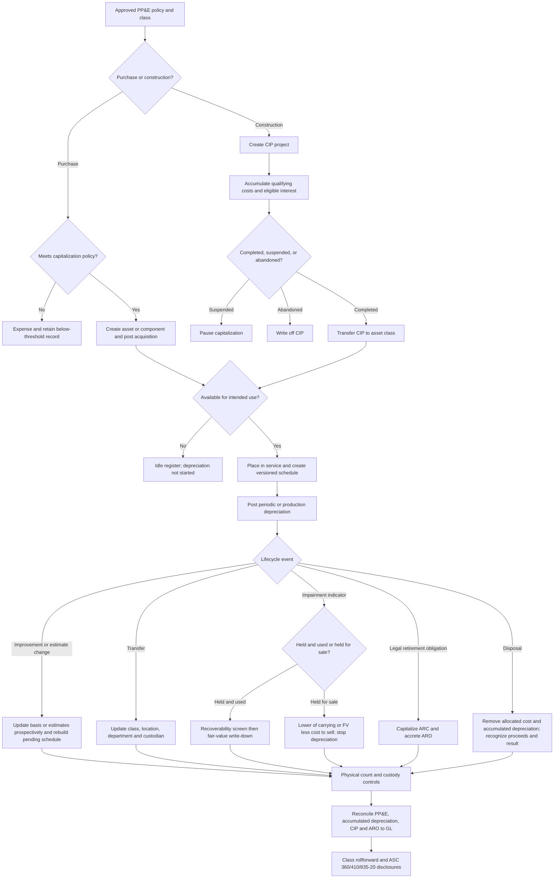

# Fixed Assets module

Folio's Fixed Assets module is a separate, tenant-isolated property, plant, and equipment subledger.
It retains capitalization decisions, asset/component identity, cost and custody evidence, depreciation,
CIP, impairment, retirement obligations, physical counts, disposal history, and immutable journal
lineage. The general ledger remains the authoritative book of record.

## Accounting and control matrix

| Area                         | Required facts and judgment                                                                                 | Deterministic processing                                                                                                               | Journal effect                                                                            | Evidence and output                                                           |
| ---------------------------- | ----------------------------------------------------------------------------------------------------------- | -------------------------------------------------------------------------------------------------------------------------------------- | ----------------------------------------------------------------------------------------- | ----------------------------------------------------------------------------- |
| Capitalization policy        | Effective policy, class threshold, group-purchase threshold, directly attributable cost, exception approval | Applies effective class/corporate threshold and records below-threshold property separately                                            | Capitalized: Dr PP&E/Cr cash or AP; expensed: Dr approved expense/Cr cash or AP           | Effective policy, approver, invoice/receiving evidence, capitalization result |
| Asset classes and components | Nature, separate useful-life pattern, parent asset, entity, location and custodian                          | Maintains separately depreciated components under a parent asset                                                                       | Each qualifying component has its own acquisition and depreciation journals               | Asset/class/component register, tag, serial, vendor, location and custody     |
| Placed in service            | Date asset is in location and condition necessary for intended use                                          | Depreciation does not begin for an idle acquired asset until the approved placed-in-service event                                      | No additional journal for a direct acquisition; controlled schedule activation            | Intended-use evidence and event history                                       |
| Depreciation                 | Method, convention, useful life, residual value, declining-balance factor or production capacity            | Straight-line, declining balance, double-declining, or units-of-production; exact-cent residual floor                                  | Dr depreciation expense/Cr accumulated depreciation                                       | Versioned schedule, posted period and journal lineage                         |
| Conventions                  | Full-month, next-month or half-month policy                                                                 | Converts the selected convention into exact schedule weights without losing cents                                                      | Included in periodic depreciation                                                         | Convention and effective policy retained on each asset                        |
| ASC 250 estimate change      | Revised remaining life, residual value or method, effective date and reason                                 | Cancels only pending schedule rows and applies the change prospectively to current carrying value                                      | Future depreciation changes; no retrospective catch-up                                    | Before/after estimates, carrying value, approver and basis                    |
| Subsequent expenditure       | Whether expenditure extends life, increases capacity or improves output quality                             | Capitalizes only a supported improvement and rebuilds the prospective schedule                                                         | Dr PP&E/Cr cash or AP                                                                     | Improvement attributes, evidence and related estimate change                  |
| Transfers                    | New class, entity/location/department/custodian and approval                                                | Reclassifies gross carrying value when the asset class/account changes                                                                 | Dr destination PP&E/Cr source PP&E                                                        | Before/after custody and classification history                               |
| CIP                          | Project, qualifying costs, construction/capitalization dates and suspension                                 | Accumulates qualifying costs; expenses excluded costs; suspends new costs when project is suspended                                    | Dr CIP or expense/Cr cash or AP                                                           | Project and cost ledger, vendor/invoice detail, status history                |
| ASC 835-20 interest          | Qualifying asset, interest incurred, avoidable interest and active construction                             | Caps capitalized interest at the lower of incurred and avoidable interest                                                              | Dr CIP/Cr interest expense                                                                | Inputs, calculation, project linkage and journal                              |
| CIP completion/abandonment   | Intended-use completion or approved abandonment                                                             | Transfers accumulated cost to the final class and starts depreciation, or writes off abandoned CIP                                     | Completion: Dr PP&E/Cr CIP; abandonment: Dr impairment loss/Cr CIP                        | Project-to-asset lineage or abandonment evidence                              |
| ASC 360 held and used        | Asset-group facts, undiscounted cash flows, fair value and valuation evidence                               | Performs recoverability screen; if failed, writes carrying value to fair value and rebuilds depreciation prospectively                 | Dr impairment loss/Cr PP&E                                                                | Recoverability result, Level 1–3, technique, inputs and journal               |
| ASC 360 held for sale        | Sale criteria conclusion, fair value and cost to sell                                                       | Stops depreciation; measures at lower of carrying value or fair value less cost to sell; recovery capped at prior impairment           | Dr/Cr impairment and PP&E                                                                 | Classification date, remeasurements, stopped schedule and valuation evidence  |
| Return to use                | Held-for-sale criteria no longer met, adjusted no-sale carrying value and recoverable amount                | Uses the lower of adjusted carrying value and recoverable amount, then restarts depreciation                                           | Dr/Cr PP&E and impairment                                                                 | Reason, measurement inputs and resumed schedule                               |
| Disposal/retirement          | Date, proceeds, portion disposed and ARO treatment                                                          | Allocates cost, impairment and accumulated depreciation; supports full or partial disposal                                             | Dr cash and accumulated depreciation; Cr PP&E; Dr/Cr disposal loss/gain                   | Proceeds, carrying basis, realized result and remaining asset                 |
| ASC 410 ARO                  | Existing legal obligation, recognition/settlement dates, fair value, credit-adjusted risk-free rate         | Capitalizes retirement cost, builds accretion schedule, supports remeasurement and settlement                                          | Initial Dr PP&E/Cr ARO; accretion Dr expense/Cr ARO; settlement clears liability and cash | Legal basis, valuation inputs, liability schedule and settlement result       |
| Physical inventory           | Count scope/date, tag scan, observed location/custodian and condition                                       | Records found, missing, damaged and untagged observations; closes count without deleting exceptions                                    | No automatic disposal journal                                                             | Count evidence and unresolved exception report                                |
| Reconciliation               | Asset register, CIP projects, AROs and posted GL through reporting date                                     | Compares gross PP&E by account, accumulated depreciation, CIP and ARO liabilities                                                      | No new journal                                                                            | Difference and reconciled flag for each control account                       |
| Disclosures                  | Reporting period, class policies, schedules and activity                                                    | Produces class balances/useful-life ranges, rollforward, future depreciation, CIP, impairment, held-for-sale, ARO and count exceptions | Underlying posted journals only                                                           | `GET /api/fixed-assets/disclosures`                                           |

## End-to-end flow

## API inventory

| Method and path                                               | Purpose                                                                          |
| ------------------------------------------------------------- | -------------------------------------------------------------------------------- |
| `GET /api/fixed-assets/overview`                              | Register totals, CIP, reconciliation and disclosures                             |
| `GET /api/fixed-assets` / `:id`                               | Asset register or complete asset/component history                               |
| `GET /api/fixed-assets/classes`                               | Asset class and default policy register                                          |
| `GET /api/fixed-assets/reconciliation`                        | PP&E, accumulated depreciation, CIP and ARO comparison to the GL                 |
| `GET /api/fixed-assets/disclosures`                           | Class balances, activity, useful lives, future depreciation and judgment records |
| `POST /api/fixed-assets/policies` / `classes`                 | Effective policy and class configuration                                         |
| `POST /api/fixed-assets`                                      | Acquire, capitalize or expense property under policy                             |
| `POST /api/fixed-assets/place-in-service`                     | Confirm intended use and activate depreciation                                   |
| `POST /api/fixed-assets/depreciation/recognize`               | Post due scheduled depreciation through a date                                   |
| `POST /api/fixed-assets/usage`                                | Record units-of-production depreciation                                          |
| `POST /api/fixed-assets/estimate-changes`                     | Apply a prospective method/life/residual change                                  |
| `POST /api/fixed-assets/improvements` / `transfers`           | Capitalize improvements or change class/custody                                  |
| `POST /api/fixed-assets/cip` and `/cip/*`                     | Create, cost, suspend/resume, capitalize interest, complete or abandon CIP       |
| `POST /api/fixed-assets/impairments`                          | Record ASC 360 held-and-used or held-for-sale assessment                         |
| `POST /api/fixed-assets/held-for-sale/*`                      | Remeasure or return an asset to held and used                                    |
| `POST /api/fixed-assets/disposals`                            | Record full or partial retirement/disposal                                       |
| `POST /api/fixed-assets/retirement-obligations` and subroutes | Recognize, accrete, remeasure and settle an ARO                                  |
| `POST /api/fixed-assets/inventory-*`                          | Start, observe and complete a physical inventory count                           |

All routes use Folio's authenticated tenant context and role permissions. Every automatic journal is
balanced, posted, hashed, immutable, period-controlled, and linked to its originating asset event.

## Scope boundary

The module covers ordinary corporate PP&E. It does not automate depletion, oil-and-gas full-cost or
successful-efforts accounting, regulated plant accounting, biological assets, government fund
accounting, tax depreciation/MACRS, personal-property tax returns, lease accounting, or real-estate
held primarily for sale. Lease ROU assets remain in Folio's ASC 842 module; internal-use software
remains in the software module. A qualified accountant must approve policy thresholds, componentization,
useful lives, impairment asset groups, valuation inputs, held-for-sale criteria, ARO legal scope, and
financial-statement disclosure completeness.

## Standards references

- [FASB Codification—the authoritative source of nongovernmental U.S. GAAP](https://fasb.org/standards)
- [FASB Statement 143 summary—asset retirement obligations](https://fasb.org/page/PageContent?bcpath=tff&pageId=%2Freference-library%2Fsuperseded-standards%2Fsummary-of-statement-no-143.html)
- [FASB Interpretation 47 summary—conditional asset retirement obligations](https://fasb.org/page/PageContent?bcpath=tff&pageId=%2Freference-library%2Fsuperseded-standards%2Fsummary-of-interpretation-no-47.html)
- [FASB Statement 34 summary—capitalization of interest cost](https://fasb.org/page/PageContent?bcpath=tff&pageId=%2Freference-library%2Fsuperseded-standards%2Fsummary-of-statement-no-34.html)
- [FASB GAAP Taxonomy useful-life and PP&E class example](https://fasb.org/taxonomyfaq)

As of August 23, 2026, the March 2026 FASB Board decisions affecting Topics 360 and 410 are tentative
codification-improvement decisions. Folio does not treat them as effective guidance.
