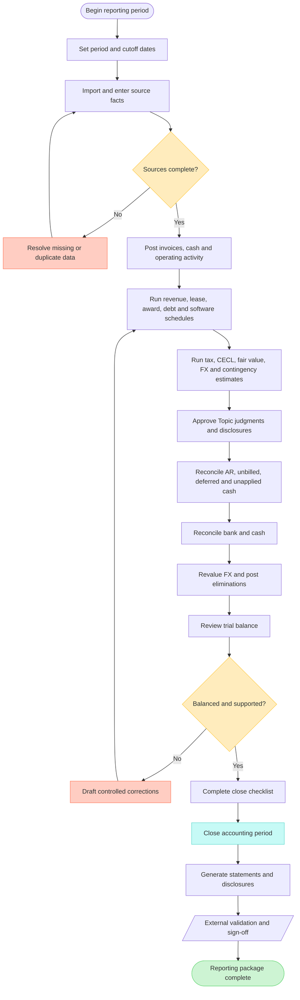
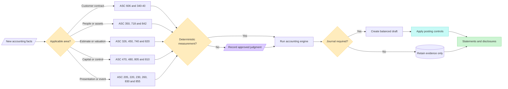

# Folio GAAP engine flow

This document shows how accounting facts become controlled journals, financial statements, disclosures, reconciliations, and SaaS metrics. It reflects the implemented repository flow rather than a conceptual target architecture.

## End-to-end accounting flow

```mermaid
flowchart LR
    start([Economic event])

    subgraph inputs ["Source facts and evidence"]
        contractFacts[/"Contracts, invoices and cash"/]
        workforceFacts[/"Awards, payroll and commissions"/]
        assetFacts[/"Leases, software, debt and acquisitions"/]
        estimateFacts[/"Tax, forecasts, valuations and legal matters"/]
    end

    subgraph governance ["Identity and accounting governance"]
        authCheck{Authenticated member?}
        tenantScope[Bind organization scope]
        policyCheck{Policy or judgment needed?}
        policyRecord[/"Approved basis and evidence"/]
    end

    subgraph engines ["Measurement and subledgers"]
        transactionEngine["Revenue and receivables"]
        scheduleEngine["Lease, award and debt schedules"]
        estimateEngine["Tax, CECL, fair value and contingencies"]
        entityEngine["FX, combinations and consolidation"]
    end

    subgraph ledger ["Controlled general ledger"]
        journalDraft[Draft balanced journal]
        validationGate{Journal valid?}
        approvalGate{Posting authorized?}
        periodGate{Period open?}
        postedLedger[(Immutable posted ledger)]
        auditEvidence[(Hash and audit log)]
    end

    subgraph outputs ["Close and reporting outputs"]
        reconcile["Subledger and GL reconciliations"]
        closeGate{Close checks complete?}
        statements["Six financial statements"]
        disclosures["Topic disclosures and judgments"]
        saasMetrics["SaaS metrics and operating views"]
        externalReview[/"Accountant and auditor review"/]
    end

    start --> contractFacts & workforceFacts & assetFacts & estimateFacts
    contractFacts & workforceFacts & assetFacts & estimateFacts --> authCheck
    authCheck -->|"No"| denied([Request denied])
    authCheck -->|"Yes"| tenantScope
    tenantScope --> policyCheck
    policyCheck -->|"Yes"| policyRecord
    policyRecord --> transactionEngine & scheduleEngine & estimateEngine & entityEngine
    policyCheck -->|"No"| transactionEngine & scheduleEngine & estimateEngine & entityEngine
    transactionEngine & scheduleEngine & estimateEngine & entityEngine --> journalDraft
    journalDraft --> validationGate
    validationGate -->|"No"| rejected([Validation exception])
    validationGate -->|"Yes"| approvalGate
    approvalGate -->|"No"| journalDraft
    approvalGate -->|"Yes"| periodGate
    periodGate -->|"Closed"| rejected
    periodGate -->|"Open"| postedLedger
    postedLedger --> auditEvidence
    postedLedger --> reconcile
    reconcile --> closeGate
    closeGate -->|"Incomplete"| journalDraft
    closeGate -->|"Complete"| statements & disclosures & saasMetrics
    auditEvidence --> externalReview
    statements & disclosures & saasMetrics --> externalReview

    style inputs fill:#C2E5FF,stroke:#3DADFF
    style governance fill:#FFECBD,stroke:#FFC943
    style engines fill:#DCCCFF,stroke:#874FFF
    style ledger fill:#C6FAF6,stroke:#5AD8CC
    style outputs fill:#CDF4D3,stroke:#66D575
    style denied fill:#FFCDC2,stroke:#FF7556
    style rejected fill:#FFCDC2,stroke:#FF7556
```

## Period-close operating flow

## Topic routing flow

## How to read the diagrams

- Blue input areas are source facts supplied by integrations or accounting users.
- Yellow diamonds are control or judgment gates; the engine does not invent missing facts.
- Violet steps are Topic-specific measurement or accountable judgment work.
- Teal steps are deterministic ledger controls.
- Green outputs are reporting artifacts; they remain subject to external accounting validation.
- Red endpoints represent rejected requests, validation exceptions, or correction loops.

For field-level detail, use the [GAAP API reference](gaap-api.md). For Topic scope and control ownership, use the [coverage matrix](gaap-coverage-matrix.md).

## Implementation traceability

| Layer | Implementation | Responsibility | Primary verification |
| --- | --- | --- | --- |
| Tenant ledger | `lib/db.js` | Core accounts, balanced drafts, authorized posting, as-of trial balance, immutable posted records and hashes | `test/ledger.test.js`, `test/tenancy.test.js` |
| SaaS accounting | `lib/saas.js` | ASC 606 contracts and schedules, invoices, payments, AR reconciliation, commissions, software, metrics, FX and eliminations | `test/saas.test.js` |
| GAAP engines | `lib/gaap.js` | Topic measurement tables, policy/judgment evidence, journals, schedules, remeasurements and disclosures | `test/gaap.test.js` |
| Close operations | `lib/operations.js` | Fiscal configuration, bank reconciliation, evidence attachments, close checklist and exception queue | `test/production.test.js` |
| Financial reports | `lib/reports.js` | Six statement models plus CSV/PDF rendering and cutoff parameters | `test/production.test.js`, `test/gaap.test.js` |
| Identity control plane | `lib/platform.js` | Users, organizations, roles, memberships, sessions, CSRF, idempotency and platform audit | `test/auth.test.js`, `test/api.test.js` |
| HTTP boundary | `server.js` | Authenticated tenant binding, permissions, GAAP routes, report routes and webhook controls | `test/api.test.js`, `test/tenancy.test.js` |
| User workspace | `frontend/main.jsx` | Role-aware modules, GAAP overview and downloadable statement links | Production build gate |
