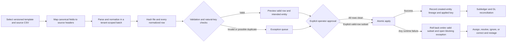

# Controlled import, mapping, and exception workflow

Folio imports are staged accounting operations, not direct CSV-to-database uploads. Every batch retains
its original filename and SHA-256 hash, template and mapping versions, actor, row-level normalized
values, validation results, natural key, outcome, created entity, approval, and application time.

## Workflow

## Version 1 template matrix

| Template           | Natural key             | Application behavior                                                   | Important boundary                                                                     |
| ------------------ | ----------------------- | ---------------------------------------------------------------------- | -------------------------------------------------------------------------------------- |
| Chart of accounts  | Account code            | Creates active account and audit event                                 | Does not update an existing account                                                    |
| Opening balances   | Source ID               | Creates a balanced draft against an explicit offset account            | Never posts automatically; controller reviews and posts                                |
| Customers          | Source ID               | Creates the customer master record and import audit event              | Source ID is retained in import lineage rather than customer display data              |
| Customer contracts | Contract number         | Creates one ASC 606 contract with one flat-file performance obligation | Multi-obligation contracts should use API/UI entry or a future hierarchical template   |
| Invoices           | Invoice number          | Creates and posts the invoice subledger/GL transaction                 | Requires an existing contract ID                                                       |
| Customer payments  | Payment number          | Creates and posts an unapplied receipt                                 | Invoice applications remain a reviewed receivables operation                           |
| Bank transactions  | Provider transaction ID | Atomically creates one statement batch and runs deterministic matching | Statement metadata is supplied outside the row CSV; no bank credentials enter the file |
| Journal drafts     | Source ID               | Creates a balanced two-sided draft                                     | Never posts automatically and supports one debit/credit pair per v1 row                |
| Investments        | Instrument number       | Creates a classified investment instrument                             | Purchases, lots, measurements and sales remain separate controlled transactions        |
| Fixed assets       | Asset number            | Runs capitalization policy and creates the acquisition transaction     | Requires an existing fixed-asset class and qualifying-PP&E assertion                   |

Template definitions are returned by `GET /api/imports/templates`, including required fields, types,
enumerations, version, sample header, and batch-level options. Source headers default to canonical field
names. API clients may provide a target-to-source `mapping` object and administrators may save
versioned mapping profiles.

## Validation and duplicate controls

- CSV parsing supports quoted commas, escaped quotes, CRLF/LF, and UTF-8 BOM input.
- Files are limited to 5 MB and 10,000 data rows; filenames are reduced to safe leaf names.
- Required fields, ISO dates, safe integers, cents, decimals, booleans, and enumerations are normalized
  before preview.
- Text beginning with `=`, `+`, `-`, or `@` is rejected to prevent spreadsheet-formula injection in
  later exports or operational review.
- Duplicate detection uses template plus natural key, both inside the current file and across
  successfully applied batches. The exact same file/template hash cannot be staged twice.
- Invalid and duplicate rows are never applied. Applying a clean batch requires approval; applying
  only valid rows from a batch with exceptions requires a separate explicit choice.
- Application is atomic across the approved valid subset. A runtime database or accounting-policy
  failure rolls back every entity from that apply attempt and creates a blocking exception.
- Repeating `apply` on an already applied batch returns the recorded result without another financial
  effect.

## Permissions and API

| Method and route                        | Purpose                                               | Permission                            |
| --------------------------------------- | ----------------------------------------------------- | ------------------------------------- |
| `GET /api/imports/templates`            | Inspect current template contracts                    | Read                                  |
| `GET /api/imports/batches`              | List bounded batch history                            | Read                                  |
| `GET /api/imports/batches/:id`          | Review rows, mapping, hashes, outcomes and exceptions | Read                                  |
| `POST /api/imports/stage`               | Parse, map, validate and stage a file                 | Operate + CSRF + idempotency key      |
| `POST /api/imports/batches/:id/approve` | Approve all clean rows or explicit valid subset       | Operate + CSRF                        |
| `POST /api/imports/batches/:id/apply`   | Atomically apply an approved batch                    | Operate + CSRF; repository idempotent |
| `GET /api/imports/mapping-profiles`     | List active mapping versions                          | Read                                  |
| `POST /api/imports/mapping-profiles`    | Save a validated mapping profile                      | Admin + CSRF                          |
| `GET /api/imports/exceptions`           | Inspect validation and application exceptions         | Read                                  |
| `POST /api/imports/exceptions/status`   | Record a disposition and owner                        | Operate + CSRF                        |

## Verification and remaining production work

Automated tests cover all ten templates, custom source mappings, formula-like input, validation errors,
within-file and cross-batch duplicate behavior, explicit valid-row subsets, exact-file replay,
whole-batch rollback, blocking exceptions, balanced draft creation, posted subledger transactions,
bank matching, journal integrity, API authentication, CSRF, authorization, and tenant database
isolation.

Before pilot use, Folio still needs browser file selection rather than paste-only CSV entry, a visual
drag/select field mapper, downloadable template files, large-file worker processing, pagination beyond
the 250-row review window, correction/restage assistance, configurable duplicate candidates beyond
exact natural keys, approval segregation policies, and migration-volume/load evidence. These are
tracked by the production acceptance specification and are not represented as complete here.
