# Controlled import, mapping, and exception workflow

Folio imports are staged accounting operations, not direct CSV-to-database uploads. Every batch retains
its original filename and SHA-256 hash, template and mapping versions, actor, row-level normalized
values, validation results, natural key, outcome, created entity, approval, and application time.

## Workflow

```mermaid
flowchart LR
  F[Select versioned template and source CSV] --> M[Map canonical fields to source headers]
  M --> V[Parse and normalize in a tenant-scoped batch]
  V --> H[Hash file and every normalized row]
  H --> D{Validation and exact natural-key checks}
  D -->|Structurally valid and exact-key unique| FZ{Active fuzzy policy?}
  FZ -->|Yes| FI[Indexed trigram candidate search]
  FZ -->|No| P
  FI -->|Below threshold| P
  FI -->|At or above threshold| FC[Blocked candidate with score and source evidence]
  FC --> FR{Reviewer disposition}
  FR -->|Confirmed distinct with rationale| P
  FR -->|Correction required| E
  D -->|Invalid or exact duplicate| E[Exception queue]
  P[Preview valid row and intended entity]
  P --> A{Explicit operator approval}
  E --> A
  A -->|All rows clean| T[Atomic apply]
  A -->|Explicit valid-row subset| T
  T -->|Success| L[Record created-entity lineage and applied key]
  T -->|Any runtime failure| R[Roll back entire valid subset and open blocking exception]
  L --> C[Subledger and GL reconciliation]
  R --> O[Assign, resolve, ignore, or correct and restage]
  E --> X{Correction scope}
  X -->|Unapplied or failed batch| Y[Replace every source row]
  X -->|Partially applied batch| Z[Restage exception rows only]
  Y --> W[Stage linked child and supersede source]
  Z --> W
  W --> V
```

## Version 1 template matrix

| Template           | Natural key             | Application behavior                                                   | Important boundary                                                                     |
| ------------------ | ----------------------- | ---------------------------------------------------------------------- | -------------------------------------------------------------------------------------- |
| Chart of accounts  | Account code            | Creates active account and audit event                                 | Does not update an existing account                                                    |
| Opening balances   | Source ID               | Creates a balanced draft against an explicit offset account            | Never posts automatically; controller reviews and posts                                |
| Customers          | Source ID               | Creates the customer master record and import audit event              | Source ID is retained in import lineage rather than customer display data              |
| Customer contracts | Contract number         | Creates one ASC 606 contract with one flat-file performance obligation | Multi-obligation contracts should use API/UI entry or a future hierarchical template   |
| Invoices           | Invoice number          | Creates and posts the invoice subledger/GL transaction                 | Requires an existing contract ID                                                       |
| Customer payments  | Payment number          | Creates and posts an unapplied receipt                                 | Invoice applications remain a reviewed receivables operation                           |
| Bank transactions  | Provider transaction ID | Atomically creates one statement batch and runs deterministic matching | Statement metadata is supplied outside the row CSV; no bank credentials enter the file |
| Journal drafts     | Source ID               | Creates a balanced two-sided draft                                     | Never posts automatically and supports one debit/credit pair per v1 row                |
| Investments        | Instrument number       | Creates a classified investment instrument                             | Purchases, lots, measurements and sales remain separate controlled transactions        |
| Fixed assets       | Asset number            | Runs capitalization policy and creates the acquisition transaction     | Requires an existing fixed-asset class and qualifying-PP&E assertion                   |

Template definitions are returned by `GET /api/imports/templates`, including required fields, types,
enumerations, version, sample header, and batch-level options. Source headers default to canonical field
names. API clients may provide a target-to-source `mapping` object and administrators may save
versioned mapping profiles. The transactional UI now implements source selection, local header
detection, automatic exact-name suggestions, explicit select-based field mapping, reusable tenant
profiles, downloadable blank templates, a mapping review step and then server validation. Reused
profiles retain their ID and version on the batch; every batch also retains the exact effective mapping
snapshot.

## Validation and duplicate controls

- CSV parsing supports quoted commas, escaped quotes, CRLF/LF, and UTF-8 BOM input.
- Files are limited to 5 MB and 10,000 data rows; filenames are reduced to safe leaf names.
- Required fields, ISO dates, safe integers, cents, decimals, booleans, and enumerations are normalized
  before preview.
- Text beginning with `=`, `+`, `-`, or `@` is rejected to prevent spreadsheet-formula injection in
  later exports or operational review.
- Duplicate detection uses template plus natural key, both inside the current file and across
  successfully applied batches. The exact same file/template hash cannot be staged twice.
- Administrators may version one active fuzzy policy per template by selecting a text field and a
  70–99% similarity threshold. Values are Unicode-normalized, case/punctuation-folded and compared
  with a trigram Dice score against a bounded in-file candidate map and an indexed applied-import
  history. The effective policy version and JSON snapshot are retained on every batch.
- A fuzzy hit stores the normalized values, score, threshold, policy version, candidate row/batch and
  source type on the import row. It is a blocked candidate, never an automatic merge. An operator may
  accept it as distinct only while the batch is staged and only with a retained reviewer rationale;
  exact natural-key duplicates cannot use that override.
- Invalid and duplicate rows are never applied. Applying a clean batch requires approval; applying
  only valid rows from a batch with exceptions requires a separate explicit choice.
- Application is atomic across the approved valid subset. A runtime database or accounting-policy
  failure rolls back every entity from that apply attempt and creates a blocking exception.
- Repeating `apply` on an already applied batch returns the recorded result without another financial
  effect.
- Row previews are paged in the tenant database at 25–250 rows per request. Exception queues are
  filtered and paged server-side, with a separate open-item count, so the browser never has to fetch an
  unbounded queue.

## Correction and restaging

`Correct and restage` reconstructs editable CSV from the source batch's retained raw row values and
preserves the exact template, mapping, batch options and source-batch identifier. An unapplied staged or
failed batch must retain its complete row population. A partially applied batch includes only its
non-applied validation and duplicate rows, so already-created records cannot be replayed.

When a corrected child successfully stages from an unapplied batch, the source is atomically marked
`rejected` and its open exceptions are acknowledged with the child batch ID. Failed and partially
applied sources retain their historical status. The child always stores `restaged_from_batch_id`; the
UI exposes that lineage in review. Row-count, template and eligible-status checks prevent a caller from
misrepresenting an unrelated or incomplete file as the correction.

## Permissions and API

| Method and route                                   | Purpose                                              | Permission                            |
| -------------------------------------------------- | ---------------------------------------------------- | ------------------------------------- |
| `GET /api/imports/templates`                       | Inspect current template contracts                   | Read                                  |
| `GET /api/imports/batches`                         | List bounded batch history                           | Read                                  |
| `GET /api/imports/batches/:id`                     | Review a paged row set, mapping, hashes and outcomes | Read                                  |
| `GET /api/imports/batches/:id/correction-source`   | Reconstruct eligible rows and source lineage         | Read                                  |
| `POST /api/imports/stage`                          | Parse, map, validate and stage a file                | Operate + CSRF + idempotency key      |
| `POST /api/imports/batches/:id/approve`            | Approve all clean rows or explicit valid subset      | Operate + CSRF                        |
| `POST /api/imports/batches/:id/apply`              | Atomically apply an approved batch                   | Operate + CSRF; repository idempotent |
| `GET /api/imports/mapping-profiles`                | List active mapping versions                         | Read                                  |
| `POST /api/imports/mapping-profiles`               | Save a validated mapping profile                     | Admin + CSRF                          |
| `GET /api/imports/duplicate-policies`              | List fuzzy policies, versions and indexed row counts | Read                                  |
| `POST /api/imports/duplicate-policies`             | Version a policy and rebuild its applied-row index   | Admin + CSRF                          |
| `GET /api/imports/exceptions`                      | Filter and page validation/application exceptions    | Read                                  |
| `POST /api/imports/exceptions/status`              | Record a disposition and owner                       | Operate + CSRF                        |
| `POST /api/imports/exceptions/:id/accept-distinct` | Approve a fuzzy candidate with reviewer rationale    | Operate + CSRF                        |

## Verification and remaining production work

Automated tests cover all ten templates, custom source mappings, formula-like input, validation errors,
within-file and cross-batch duplicate behavior, explicit valid-row subsets, exact-file replay,
whole-batch rollback, blocking exceptions, balanced draft creation, posted subledger transactions,
bank matching, correction scope and parent/child lineage, row-count safeguards, row/exception
pagination, fuzzy policy versioning, indexed historical and in-file candidates, exact-duplicate
non-override, reviewed distinct-record disposition, schema upgrades, journal integrity, API
authentication, CSRF, authorization, and tenant database isolation. `npm run test:load` additionally
stages and applies the documented 10,000-row maximum, rebuilds its fuzzy index, finds a historical
candidate, and enforces a configurable per-step ceiling in CI.

The fuzzy index intentionally covers the current file and applied import lineage, not manually-created
master records or provider-native records. It uses one configured text field per template and provides
candidates rather than entity merge logic. Before pilot use, Folio still needs large-file worker
processing, approval segregation policies, production-shaped migration/load/soak evidence and a
controller review of threshold behavior. These boundaries remain tracked by the production acceptance
specification.
