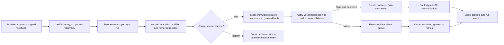

# Integration platform and initial connector design

This document describes the engineering foundation introduced after v0.2.0. It does not claim that
live Plaid, Stripe, Gusto, or HubSpot OAuth connections are production-ready. Provider HTTP clients,
hosted authorization handoffs, verified webhooks, worker scheduling, and credentialed sandbox
contract tests remain required before a connector can carry live financial data.

## Initial matrix

| Provider | Domain               | Folio-owned normalized scope                                                              | Cursor model                           | Current implementation                                                       | Still required for live use                                                                                               |
| -------- | -------------------- | ----------------------------------------------------------------------------------------- | -------------------------------------- | ---------------------------------------------------------------------------- | ------------------------------------------------------------------------------------------------------------------------- |
| Plaid    | Bank                 | Accounts, transaction additions, modifications and removals                               | `transactions_sync` cursor             | Catalog, connection state, staged records, cursor/run metrics and exceptions | Link handoff, token exchange in a worker, JWT webhook verification and Plaid sandbox contract suite                       |
| Stripe   | Billing and payments | Customers, subscriptions, invoices, credits, charges, refunds, disputes, fees and payouts | Created-time/ID pagination plus events | Same common connector contract                                               | OAuth/restricted-key exchange, raw-body signature verification, event replay/backfill and payout reconciliation           |
| Gusto    | Payroll              | Companies, payroll runs, taxes, benefits and departments                                  | Event timestamp plus bounded backfill  | Same common connector contract                                               | OAuth lifecycle, company-scoped token handling, versioned API adapter, verified event delivery and payroll-to-GL mappings |
| HubSpot  | CRM                  | Companies, deals, products and line items                                                 | Updated-after watermark                | Same common connector contract                                               | OAuth lifecycle, signed webhooks, association pagination, property mapping and contract-handoff review                    |

The provider behavior assumptions above follow the vendors' current official documentation:
[Plaid transaction sync](https://plaid.com/docs/transactions/sync-migration/),
[Plaid webhook verification](https://plaid.com/docs/api/webhooks/webhook-verification/),
[Stripe webhook signatures](https://docs.stripe.com/webhooks/signature),
[Gusto authentication](https://docs.gusto.com/embedded-payroll/docs/authentication), and
[HubSpot request signatures](https://developers.hubspot.com/docs/apps/legacy-apps/authentication/validating-requests).
They must be revalidated when a provider adapter is certified.

## Common state and security contract

Connections move through `configured → active → paused/error → active`, with terminal
`disconnected`. Configuration stores only secret-manager reference names; secret-looking keys are
rejected from general settings. Production configuration also requires the provider's external
account/company identifier. Tokens and provider secrets must never be sent to the browser or written
to Folio tables or logs.

Configuration, mapping and connection-state changes require the administrator role. Reads require an
authenticated tenant member. Synchronization and exception operations require accounting-operator
access. Existing tenant database isolation, session authorization and CSRF controls apply to every
route.

## Data flow

This commit implements the connection, run, staged-record, mapping and dead-letter persistence shown
above. Automatic mapping application and the provider-specific adapter/worker layer are not yet
implemented.

## API inventory

| Method and route                                | Purpose                                          | Permission |
| ----------------------------------------------- | ------------------------------------------------ | ---------- |
| `GET /api/integrations/catalog`                 | Approved provider capabilities                   | Read       |
| `GET /api/integrations/overview`                | Connections, recent runs, exceptions and metrics | Read       |
| `GET /api/integrations/connections`             | Tenant connector register                        | Read       |
| `POST /api/integrations/connections`            | Configure a reference-only connection            | Admin      |
| `POST /api/integrations/connections/status`     | Activate, pause or disconnect                    | Admin      |
| `POST /api/integrations/sync-runs`              | Open a bounded sync run                          | Operate    |
| `POST /api/integrations/sync-runs/:id/page`     | Idempotently stage a cursor page                 | Operate    |
| `POST /api/integrations/sync-runs/:id/fail`     | Fail a run and create an exception               | Operate    |
| `GET /api/integrations/connections/:id/records` | Inspect staged normalized records                | Read       |
| `POST /api/integrations/mappings`               | Create a versioned mapping                       | Admin      |
| `GET /api/integrations/exceptions`              | Inspect integration dead letters                 | Read       |
| `POST /api/integrations/exceptions/status`      | Retry, resolve or ignore an exception            | Operate    |

## Verification in this increment

Automated tests cover the four-provider catalog, secret-reference boundary, production account-ID
requirement, legal state changes, cursor advancement, added/modified/removed records, replay
idempotency, failed-run exception creation and operator resolution. Live acceptance additionally
requires sandbox contract tests, webhook tamper/replay tests, throttling and stale-cursor tests, worker
recovery, provider-schema fixtures, and a credentialed staging synchronization.
