# Integration platform and initial connector design

This document describes the engineering foundation introduced after v0.2.0. Provider HTTP adapters
and a tenant-scoped synchronization worker are implemented and contract-tested against versioned
fixtures. This does not claim that live Plaid, Stripe, Gusto, or HubSpot OAuth connections are
production-ready: hosted authorization handoffs, verified provider-specific webhooks, scheduling,
provider sandbox certification and credentialed staging evidence remain required before a connector
can carry live financial data.

## Initial matrix

| Provider | Domain               | Folio-owned normalized scope                                                              | Cursor model                           | Current implementation                                                                                                                                                                     | Still required for live use                                                                                                                |
| -------- | -------------------- | ----------------------------------------------------------------------------------------- | -------------------------------------- | ------------------------------------------------------------------------------------------------------------------------------------------------------------------------------------------ | ------------------------------------------------------------------------------------------------------------------------------------------ |
| Plaid    | Bank                 | Accounts, transaction additions, modifications and removals                               | `transactions_sync` cursor             | Versioned adapter, pagination restart, staged outcomes, retries, account binding, native versioned bank feed, unique posted-cash matching and close-blocking exceptions                    | Link handoff/token exchange, JWT webhook verification, operator-assisted matching, sandbox certification and credentialed staging evidence |
| Stripe   | Billing and payments | Customers, subscriptions, invoices, credits, charges, refunds, disputes, fees and payouts | Created-time/ID pagination plus events | Signed, connection-bound events; native source-to-contract/AR reconciliation; fee-bearing payout expansion; payout-to-bank-to-journal proof; version lineage, exception and close controls | OAuth/restricted-key exchange, provider sandbox certification, credentialed staging evidence and deployed soak                             |
| Gusto    | Payroll              | Companies, payroll runs, taxes, benefits and departments                                  | Processed-date watermark plus page     | Versioned payroll adapter, header-driven paging, total normalization, retries, staged outcomes, mapping preview and approved draft-journal application                                     | OAuth lifecycle, verified events, detailed payroll receipts, native payroll subledger handoff and sandbox certification                    |
| HubSpot  | CRM                  | Companies, deals, products and line items                                                 | Updated-after watermark plus `after`   | Versioned search adapter, property normalization, updated watermark, retries, staged outcomes, mapping preview and approved draft-journal application                                      | OAuth lifecycle, signed webhooks, association expansion, native contract handoff and sandbox certification                                 |

The provider behavior assumptions above follow the vendors' current official documentation:
[Plaid transaction sync](https://plaid.com/docs/transactions/sync-migration/),
[Plaid webhook verification](https://plaid.com/docs/api/webhooks/webhook-verification/),
[Stripe webhook signatures](https://docs.stripe.com/webhooks/signature),
[Gusto authentication](https://docs.gusto.com/embedded-payroll/docs/authentication), and
[HubSpot request signatures](https://developers.hubspot.com/docs/apps/legacy-apps/authentication/validating-requests).
They must be revalidated when a provider adapter is certified.

## Common state and security contract

Connections move through `configured → active → paused/error → active`, with terminal
`disconnected`. Configuration stores only secret-manager reference names; secret-looking keys are
rejected from general settings. Production configuration also requires the provider's external
account/company identifier. Tokens and provider secrets must never be sent to the browser or written
to Folio tables or logs.

Configuration, mapping and connection-state changes require the administrator role. Reads require an
authenticated tenant member. Synchronization and exception operations require accounting-operator
access. Existing tenant database isolation, session authorization and CSRF controls apply to every
route.

Production Stripe endpoints use
`POST /webhooks/stripe/<organization-slug>/<integration-connection-id>`. Folio resolves only that
active Stripe connection's secret-manager reference and rejects a signed Connect event whose
top-level account differs from the configured external account. The older slug-only endpoint is
available for local/test compatibility and is fail-closed in production.

## Data flow

```mermaid
flowchart LR
  P[Provider adapter or signed webhook] --> V[Verify identity, scope and replay key]
  V --> Q[Durably enqueue and acknowledge]
  Q --> W[Leased worker with bounded retry]
  W --> R[Start tenant-scoped sync run]
  R --> N[Normalize added, modified and removed records]
  N --> D{Unique source version?}
  D -->|Yes| S[Stage immutable source outcome and payload hash]
  D -->|Replay| I[Count duplicate without another financial effect]
  S --> M{Native domain route?}
  M -->|Plaid bank transaction| B[Validate account binding and source version]
  B -->|Approved| K[Match one unique posted cash line]
  K -->|No or multiple candidates| E
  M -->|Stripe billing or payment| T[Validate identity amount currency and lifecycle]
  T -->|Charge invoice refund etc.| U[Link existing Folio subledger record]
  T -->|Payout| Y[Prove components and match bank deposit]
  Y --> K
  U --> C
  M -->|Generic controlled mapping| G[Validate journal-draft mapping]
  G -->|Valid and approved| A[Create auditable Folio draft]
  M -->|Failure| E[Exception/dead-letter queue]
  A --> C[Subledger-to-GL reconciliation]
  E --> O[Owner resolves, ignores or retries]
  C --> X[Close controls and run metrics]
  O --> X
```



The provider adapters resolve JSON credentials only through the configured secret reference, never
through connection settings or browser payloads. They enforce bounded pages, 30-second request
timeouts, capped exponential retries for throttling and transient server failures, sanitized error
messages, immutable source hashes and idempotent replay. Plaid's documented mutation-during-paging
condition restarts the entire update from the original persisted cursor; already-staged records are
deduplicated. The CLI worker can be run for one tenant connection with:

```sh
npm run integrations:sync -- --database=data/tenants/<tenant>.db --connection=<connection-id>
```

The scheduler must supply one JSON credential secret file/environment reference for the selected
connection. Hosted authorization and provider-specific native subledger application remain separate
controlled workflows.

Connection-bound signed webhooks are verified and durably inserted into the platform delivery queue
before HTTP 202 is returned. A separate worker claims one delivery with a time-limited lease, applies
capped exponential retries, reclaims expired leases after a process crash and moves exhausted work to
`dead_letter`. Operators can requeue a corrected delivery with
`npm run webhooks:worker -- --retry-delivery=<delivery-id>`. Prometheus exposes queue status and oldest
unfinished age; stale work and any dead letter page the operator.

Financial application then uses a tenant-local durable inbox. The provider/event replay key, payload
hash, serialized result, subledger mutation and posted journal commit in one SQLite transaction. A
worker crash therefore rolls back partial tenant effects; if it crashes after tenant commit but before
queue completion, the reclaimed delivery reads the original tenant result without posting again. The
platform queue is the delivery boundary, while the tenant inbox remains the accounting idempotency
boundary.

Supported native Stripe customer, subscription, invoice, credit-note, charge, refund, dispute,
balance-transaction and payout events are normalized into versioned provider records. The native
reconciliation path links those records to existing Folio customers, contracts, invoices, credit
memos, received payments, refunds and disputes only after amount, currency, customer lineage and
lifecycle validation. A Stripe customer link becomes identity-stable; later source versions cannot
silently rebind it. Modified and removed objects supersede the prior decision while retaining source
and reviewer lineage. These records do not act as client-supplied accounting commands and do not post
journals directly. Unsupported event families fail closed.

Payout synchronization expands each payout through Stripe's payout-filtered balance-transaction
endpoint, retaining gross, fee and net cents. Each component must satisfy gross less fee equals net;
the components must sum to the payout; and a paid payout must match a native, already-matched bank-feed
deposit with the same currency and net amount within seven days. An unresolved payout blocks the
period's bank-reconciled close sign-off. This produces a Stripe payout → fee/net components → Plaid
deposit → posted cash-line trail without duplicating a journal.

For non-native providers, an administrator configures connection-specific, versioned mappings into the
five-field journal draft shape: date, memo, integer-cent amount, debit account code and credit account
code. An operator previews the exact mapping fingerprint and must supply an approval note. A successful
application creates one idempotent **draft** journal; it never posts, and its application approver is
blocked from posting it. Mapping changes invalidate stale
previews, validation failures enter one record-linked exception, and removed records fail closed for a
separate reversal policy. Applying a corrected record resolves its linked mapping exception in the same
transaction.

Plaid bank transactions use a separate native path: an administrator binds each provider account ID
to one active Folio cash account and three-letter currency. An operator previews and explicitly
approves each immutable source version. Posted, non-pending transactions match only when exactly one
unused posted cash line has the same account, date and signed cash amount. Folio does not create or
post a journal from this path. Pending, unmatched and ambiguous activity remains visible; a changed or
removed previously matched source invalidates the match and creates a reconciliation exception
without silently changing the journal. Existing feed history prevents account/currency rebinding,
replays are idempotent, and unresolved period activity blocks the bank-reconciled close sign-off. For
multiple exact candidates, an operator selects one with a required rationale; Folio revalidates the
candidate at commit and retains a match-decision record. Tolerance/date-window bank matching and
provider-native payroll and CRM-to-contract handoffs remain launch work.

## API inventory

Interactive operators use `POST /api/jobs/provider-syncs` or **Sync now** in the integration workspace.
That durable job executes the same adapter outside the HTTP process and is visible in Reports & jobs.
The direct sync-run page API remains for adapter ingestion, controlled diagnostics, and compatibility.

| Method and route                                    | Purpose                                           | Permission |
| --------------------------------------------------- | ------------------------------------------------- | ---------- |
| `GET /api/integrations/catalog`                     | Approved provider capabilities                    | Read       |
| `GET /api/integrations/overview`                    | Connections, recent runs, exceptions and metrics  | Read       |
| `GET /api/integrations/connections`                 | Tenant connector register                         | Read       |
| `POST /api/integrations/connections`                | Configure a reference-only connection             | Admin      |
| `POST /api/integrations/connections/status`         | Activate, pause or disconnect                     | Admin      |
| `POST /api/integrations/sync-runs`                  | Open a bounded sync run                           | Operate    |
| `POST /api/integrations/sync-runs/:id/page`         | Idempotently stage a cursor page                  | Operate    |
| `POST /api/integrations/sync-runs/:id/fail`         | Fail a run and create an exception                | Operate    |
| `GET /api/integrations/connections/:id/records`     | Inspect staged normalized records                 | Read       |
| `GET /api/integrations/mappings`                    | Inspect active global or connection mappings      | Read       |
| `POST /api/integrations/mappings`                   | Create a versioned mapping                        | Admin      |
| `POST /api/integrations/records/:id/preview`        | Validate and fingerprint the mapped draft shape   | Operate    |
| `POST /api/integrations/records/:id/apply`          | Approve one idempotent draft-journal application  | Operate    |
| `GET /api/integrations/exceptions`                  | Inspect integration dead letters                  | Read       |
| `POST /api/integrations/exceptions/status`          | Retry, resolve or ignore an exception             | Operate    |
| `POST /api/jobs/provider-syncs`                     | Queue a durable provider synchronization          | Operate    |
| `GET /api/bank-feed`                                | Bank bindings, current versions and match metrics | Read       |
| `POST /api/bank-feed/accounts`                      | Bind a Plaid account to Folio cash                | Admin      |
| `POST /api/integrations/records/:id/bank-preview`   | Validate a native bank source version             | Operate    |
| `POST /api/integrations/records/:id/bank-apply`     | Approve idempotent bank-feed application          | Operate    |
| `GET /api/bank-feed/transactions/:id/candidates`    | List currently available exact cash candidates    | Read       |
| `POST /api/bank-feed/transactions/:id/match`        | Approve a revalidated exact cash match            | Operate    |
| `GET /api/integrations/stripe-reconciliation`       | Stripe decision and settlement ledger             | Read       |
| `POST /api/integrations/records/:id/stripe-preview` | Validate native Stripe candidates and settlement  | Operate    |
| `POST /api/integrations/records/:id/stripe-apply`   | Approve an idempotent Stripe reconciliation       | Operate    |

## Verification in this increment

Automated tests cover the four-provider catalog, secret-reference boundary, production account-ID
requirement, legal state changes, cursor advancement, added/modified/removed records, replay
idempotency, failed-run exception creation, operator resolution, provider schema fixtures, paging,
Plaid cursor mutation recovery, rate-limit retry, secret-safe failures, Stripe raw-body tamper,
timestamp replay, malformed header, rotation-signature, connection secret/account binding,
native Stripe event normalization without direct journal posting, unsupported-event denial,
production legacy-route denial, durable fast acknowledgement, queue replay, lease recovery, retry
exhaustion, dead-letter requeue, atomic inbox rollback, HTTP replay and child-process kill/restart
after both claim and tenant commit. Mapping tests cover required outputs, transforms/defaults, exact
account lookup, removal denial, stale-preview rejection, exception deduplication/resolution, transactional
draft creation and replay idempotency. Native Stripe tests cover customer identity, invoice/payment
matching, non-duplication of journals, fee/net equations, payout-to-bank reconciliation, source
changes/removals, close blocking and replay. Native Plaid tests cover account/currency binding, immutable
rebind controls, exact unique and operator-selected matching, pending items, ambiguous and unmatched queues, modified and
removed matched versions, journal non-mutation, close blocking and replay idempotency. Live acceptance additionally requires provider-hosted sandbox
contract tests, a deployment-level worker kill drill and
a credentialed staging synchronization.
