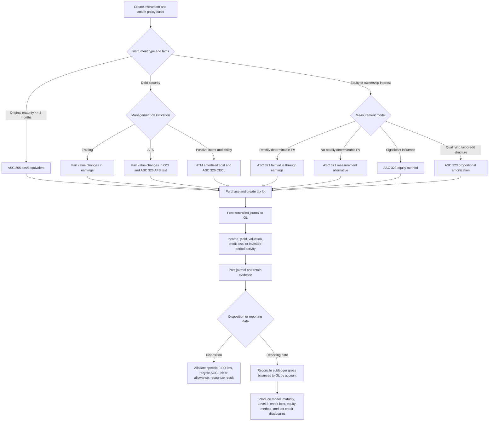

# Investments module

Folio's Investments module is a separate, tenant-isolated subledger. It preserves instrument, lot,
transaction, valuation, credit-loss, income, and journal lineage while the general ledger remains the
authoritative book of record. Policy conclusions and valuation inputs are required data; the engine
does not infer management intent, significant influence, observable transactions, or fair value.

## Accounting coverage matrix

| Guidance / model                  | Classification gate                                                                       | Subsequent measurement                                                                                                   | Income and disposal                                                       | Credit loss / impairment                                                                                                     | Folio evidence                                                                                            |
| --------------------------------- | ----------------------------------------------------------------------------------------- | ------------------------------------------------------------------------------------------------------------------------ | ------------------------------------------------------------------------- | ---------------------------------------------------------------------------------------------------------------------------- | --------------------------------------------------------------------------------------------------------- |
| ASC 305 cash equivalents          | Original maturity is three months or less; instrument uses the `cash_equivalent` model    | Cost plus applicable income                                                                                              | Interest or distribution transactions; specific-lot disposal              | Instrument-specific impairment assessment remains a judgment input                                                           | Instrument terms, original maturity, policy basis, lots, transactions, journals                           |
| ASC 320 trading debt              | Debt security; trading classification                                                     | Fair value changes in earnings                                                                                           | Effective-yield interest; realized gain/loss using carrying value         | Fair-value changes remain in earnings; no separate HTM/AFS allowance path                                                    | Yield schedule, recurring measurements, valuation level/technique/inputs                                  |
| ASC 320 AFS debt                  | Debt security; neither trading nor HTM                                                    | Fair value; noncredit change in OCI and AOCI                                                                             | Effective-yield interest; AOCI recycling on sale                          | ASC 326 allowance capped by the fair-value shortfall; intent/requirement to sell writes amortized cost down through earnings | Gross asset, allowance, amortized cost, fair value, AOCI, credit-loss assessment, sale journal            |
| ASC 320 HTM debt                  | Positive intent and ability to hold to maturity                                           | Amortized cost using effective yield                                                                                     | Interest accretion/amortization and principal at maturity                 | ASC 326 lifetime expected-credit-loss allowance                                                                              | Classification assertion, amortized-cost schedule, CECL method/assumptions, allowance rollforward         |
| ASC 321 equity — fair value       | Equity security with readily determinable fair value                                      | Fair value changes in earnings                                                                                           | Dividends in income; specific-lot disposal                                | Declines flow through recurring fair-value earnings                                                                          | Quoted/other valuation inputs, level, measurements, lots, realized/unrealized results                     |
| ASC 321 measurement alternative   | No readily determinable fair value; not equity method                                     | Cost less impairment, adjusted for observable same/similar issuer transactions                                           | Dividends and disposal                                                    | Qualitative impairment trigger and fair-value write-down through earnings                                                    | Trigger type, observable-price or impairment evidence, valuation technique, journal                       |
| ASC 323 equity method             | Documented significant influence or applicable current-GAAP partnership scope/presumption | Cost adjusted for investor share of earnings/losses, basis-difference amortization, other adjustments, and distributions | Share of investee results in earnings; dividends reduce basis             | Other-than-temporary decline writes carrying value to fair value and establishes a new basis                                 | Ownership, scope/influence conclusion, investee income, basis differences, dividends, impairment evidence |
| ASC 323 proportional amortization | Qualifying tax-credit structure and elected method                                        | Investment cost amortized in proportion to tax benefits                                                                  | Amortization and tax credits/benefits presented within income-tax expense | Carrying value cannot be amortized below zero                                                                                | Period amortization, credits, other tax benefits, net tax expense/benefit, journal                        |
| ASC 325 / other investments       | `other` model with explicit policy basis                                                  | Policy-directed cost or applicable specialized model                                                                     | Cash income and disposal                                                  | Requires entity-specific impairment conclusion                                                                               | Instrument/transaction history and policy evidence; no claim of automatic specialized-industry accounting |
| ASC 326 interaction               | HTM or AFS debt only in this subledger                                                    | HTM lifetime allowance; AFS allowance limited to fair-value shortfall                                                    | Allowance changes in credit-loss expense                                  | AFS intent/requirement-to-sell path removes OCI/allowance and writes down amortized cost                                     | Method, assumptions, expected loss, fair value, before/after allowance, journal                           |
| ASC 820 interaction               | Required level 1–3 and valuation technique for fair-value measurement                     | Recurring or event-driven fair value                                                                                     | Earnings or OCI determined by classification                              | Supports impairment fair-value evidence                                                                                      | Level, technique, JSON inputs, policy basis, measurement and journal IDs                                  |

## End-to-end flow

## API

| Method and path                                     | Purpose                                                                                                          |
| --------------------------------------------------- | ---------------------------------------------------------------------------------------------------------------- |
| `GET /api/investments/overview?as_of=YYYY-MM-DD`    | Position totals, instruments, reconciliation, and disclosures                                                    |
| `GET /api/investments` / `GET /api/investments/:id` | Instrument register or complete instrument history                                                               |
| `GET /api/investments/reconciliation`               | Gross investment accounts compared with the posted GL                                                            |
| `GET /api/investments/disclosures`                  | Classification totals, maturities, activity, Level 3, CECL, equity-method, and proportional-amortization details |
| `POST /api/investments`                             | Create and classify an instrument                                                                                |
| `POST /api/investments/purchases` / `sales`         | Create lots or dispose using selected lots/FIFO                                                                  |
| `POST /api/investments/income`                      | Record interest, dividends, distributions, or return of capital                                                  |
| `POST /api/investments/yield/recognize`             | Post due effective-yield periods through an as-of date                                                           |
| `POST /api/investments/interest/accruals`           | Accrue the contractual receivable, effective-yield income, and premium/discount at an interim reporting date     |
| `POST /api/investments/measurements`                | Record recurring fair value, observable changes, or measurement-alternative impairment                           |
| `POST /api/investments/credit-losses`               | Record HTM CECL or AFS credit-loss assessment                                                                    |
| `POST /api/investments/equity-method`               | Record investee income/loss, basis amortization, adjustments, and dividends                                      |
| `POST /api/investments/equity-method/impairment`    | Record an other-than-temporary equity-method impairment                                                          |
| `POST /api/investments/proportional-amortization`   | Record tax-credit investment amortization and benefits                                                           |
| `POST /api/investments/transitions`                 | Preserve model-transition evidence and transition-date accounting                                                |

All routes use the existing authenticated tenant context. Amounts are integer cents. Every automatic
journal is validated, balanced, posted, hashed, immutable, period-controlled, and linked back to its
subledger event.

## Scope boundary

The engine covers ordinary corporate treasury and strategic-investment workflows. It does not claim
specialized broker-dealer, investment-company (ASC 946), derivatives/hedging (ASC 815), insurance,
regulated operations, cryptocurrency, consolidation, or tax-return compliance. Consolidation and
business-combination conclusions remain in Folio's ASC 810 and ASC 805 engines. A qualified accountant
must approve classification, valuation, impairment, tax-credit eligibility, and disclosure completeness
for the entity's actual facts.

As of August 23, 2026, FASB's equity-method targeted-improvements project contains tentative Board
decisions only and does not change current GAAP. Folio therefore retains a separately documented
current-GAAP partnership scope basis instead of treating the proposed single significant-influence
threshold as effective guidance.

## Standards references

- [FASB ASU 2016-01 — recognition and measurement of financial assets and liabilities](https://storage.fasb.org/ASU%202016-01.pdf)
- [FASB debt-securities taxonomy implementation guide](https://xbrl.fasb.org/ix/?doc=..%2Fimpdocs%2FDS2_TIG%2Fdebtsecurities.htm)
- [FASB ASU 2023-02 — proportional amortization for tax-credit structures](https://storage.fasb.org/ASU%202023-02%E2%80%94Investments%E2%80%94Equity%20Method%20and%20Joint%20Ventures%20%28Topic%20323%29%E2%80%94Accounting%20for%20Investments%20in%20Tax%20Credit%20Structures%20Using%20the%20Proportional%20Amortization%20Method.pdf)
- [FASB equity-method targeted-improvements project status](https://fasb.org/projects/current-projects/equity-method-of-accounting%3A-targeted-improvements-423332)
