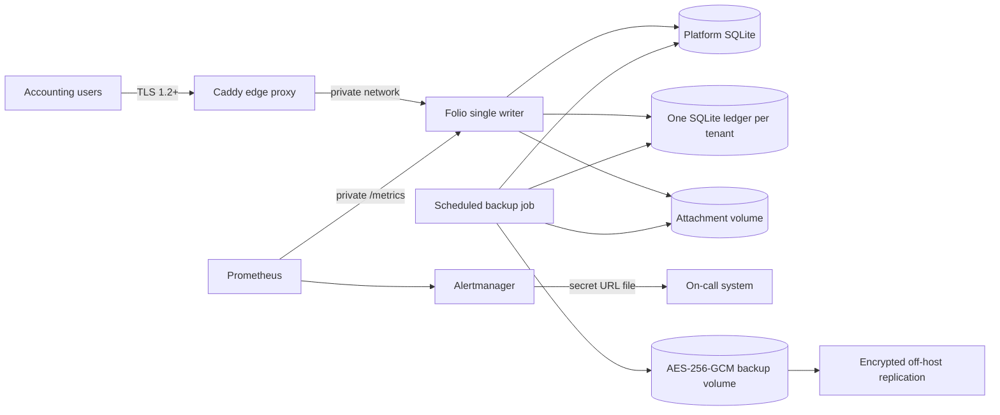

# Production operations and single-node deployment

This is Folio's executable single-node production reference. It is an engineering deployment
baseline, not evidence that a particular cloud account, DNS zone, on-call team, off-site vault, or
customer support organization has been provisioned. Pilot and production acceptance still require a
credentialed deployment and the named operational exercises below.

## Topology and boundaries



The topology deliberately runs exactly one Folio writer. It must not be placed behind multiple app
replicas or on shared SQLite storage. Horizontal scaling requires the PostgreSQL migration described
in `adr-001-production-database.md`. Caddy is the only publicly exposed service; `/metrics` is blocked
at the edge and scraped over the internal network.

The Compose definition uses read-only filesystems, dropped Linux capabilities, no-new-privileges,
non-root application/monitoring users, bounded temporary filesystems, persistent named volumes,
dependency health checks, graceful stop periods, and secret files rather than credential values in
the image. Caddy obtains and renews public TLS certificates for `FOLIO_DOMAIN`.

## Environments and secrets

Development, staging, and production require separate hosts/projects, domains, volumes, encryption
keys, provider credentials, error-tracking projects, alert routes, and backup destinations. Never
clone a production database into development. Staging receives synthetic or approved de-identified
data only.

Required production secret files:

| Secret file variable                 | Purpose                                           | Rotation evidence                                                           |
| ------------------------------------ | ------------------------------------------------- | --------------------------------------------------------------------------- |
| `BACKUP_ENCRYPTION_KEY_FILE`         | 32 random bytes encoded as base64                 | Non-secret `BACKUP_KEY_ID`, successful backup and restore using the new key |
| `PROVIDER_TOKEN_ENCRYPTION_KEY_FILE` | 32 random bytes encoded as base64                 | Non-secret `PROVIDER_TOKEN_KEY_ID`, reauthorization and worker refresh test |
| `ALERT_WEBHOOK_URL_FILE`             | On-call webhook consumed directly by Alertmanager | Successful test alert and resolved notification                             |
| `SENTRY_DSN_FILE`                    | Production error project                          | Synthetic captured error without PII                                        |
| `OPENAI_API_KEY_FILE`                | Optional journal drafting; file may be empty      | Provider rotation record and draft evaluation when enabled                  |
| `BOOTSTRAP_TOKEN_FILE`               | One-time first-administrator authorization        | Setup event, token rotation/removal decision and named operator record      |

Provider connector references point to the deployment secrets manager and are not Docker secrets in
this initial adapter-neutral stack. Live adapters must add their secret files and least-privilege
identities before certification.

## Preflight and deployment

Use an immutable registry digest, never `latest` or a mutable tag. The preflight rejects insecure
cookies, HTTP origins, loopback production binding, mutable images, malformed backup keys, missing
secret files, a bootstrap token shorter than 32 bytes, a non-HTTPS alert route, or a domain/origin
mismatch.

Authenticated requests are admitted using trusted session organization/user IDs. Defaults allow 64
active requests process-wide, 8 per tenant, and 240 requests per user per minute. Synchronous report
compatibility exports, synchronous import endpoints, integration sync creation, and AI drafting also share a 2-request
concurrency and 30-request-per-minute pool per tenant. Configure these with the six
`ADMISSION_*` variables in `.env.example`; invalid, zero, or out-of-range values fail startup. Tune
only from staging/load evidence, and keep the per-tenant values below the capacity at which one
tenant materially raises another tenant's latency.

```sh
export NODE_ENV=production HOST=0.0.0.0 SESSION_COOKIE_SECURE=true
export FOLIO_DOMAIN=folio.example.com PUBLIC_ORIGIN=https://folio.example.com
export FOLIO_IMAGE=registry.example.com/folio@sha256:<64-hex-digest>
export BACKUP_KEY_ID=backup-key-2026-08
export BACKUP_ENCRYPTION_KEY_FILE=/secure/folio/backup-key
export PROVIDER_TOKEN_ENCRYPTION_KEY_FILE=/secure/folio/provider-token-key
export PROVIDER_TOKEN_KEY_ID=provider-token-2026-08
export ALERT_WEBHOOK_URL_FILE=/secure/folio/alert-webhook
export SENTRY_DSN_FILE=/secure/folio/sentry-dsn
export OPENAI_API_KEY_FILE=/secure/folio/openai-key
export BOOTSTRAP_TOKEN_FILE=/secure/folio/bootstrap-token
npm run ops:preflight
```

Release procedure:

1. Record the release commit, immutable image digest, change owner, migration list, risk, rollback
   owner, and maintenance window in the release ticket.
2. Confirm CI, security review, accounting regression evidence, and required external approvals for
   that exact commit.
3. Run the preflight, test alert delivery, inspect disk headroom, and run an encrypted backup. Copy the
   backup to encrypted off-host storage and verify its object checksum.
4. Rehearse the migration against a restored staging copy. Run
   `docker compose -f compose.production.yml --profile operations run --rm migrate` against the
   production volume only during the approved window.
5. Start the pinned release with `docker compose -f compose.production.yml up -d --wait`. Confirm
   `/livez` and `/readyz`. For a new deployment, keep public access restricted, give the bootstrap
   token to the named setup operator out of band, create the first administrator through the setup
   screen, confirm the setup route has closed, then rotate the mounted token and record the event.
   Open approved access and confirm sign-in, dashboard, a read-only statement, Prometheus targets,
   Alertmanager, structured logs, and error tracking.
6. Run journal integrity and subledger/GL reconciliation checks, then record the release evidence.

This single-node release has a short controlled restart; it does not claim zero downtime.

## Rollback

Application rollback and data rollback are separate decisions. Never point older application code at
a schema it cannot read.

1. Stop mutations and preserve logs/request IDs. Determine whether the issue is code-only or whether
   the migration/data changed.
2. For a code-only compatible rollback, set `FOLIO_IMAGE` to the prior approved digest, run preflight,
   recreate Folio, and verify readiness, integrity, and reconciliations.
3. If schema/data rollback is required, stop Folio, preserve the failed volume as evidence, restore the
   pre-release encrypted backup into new volumes/directories, and run the prior image against the
   restored copy. Do not overwrite failed or live files.
4. Reconcile restored subledgers and statements through the recovery point. Accounting approves any
   re-entered transactions; operators never manufacture corrective journal entries silently.
5. Record recovery point, lost/replayed external events, customer impact, and follow-up owner.

## Monitoring and alert operations

Folio exposes separate `/livez` and dependency-aware `/readyz` endpoints. During graceful shutdown,
liveness remains healthy while readiness becomes 503. `/metrics` emits bounded-route Prometheus
counters and latency histograms; UUID and numeric path segments are normalized to avoid high
cardinality and identifier leakage. Admission metrics expose active/tracked counts and rejection
reasons without organization or user labels. `FolioAdmissionRejections` tickets sustained rejection
traffic; inspect the reason label and request logs, then distinguish expected client bursts from
resource saturation before raising a limit.

Repository alerts cover process availability, readiness, server-error ratio, and p95 latency. The
rules follow Prometheus's symptom-oriented alerting guidance, while Alertmanager groups, inhibits,
routes, repeats, and resolves notifications. Production owners must add infrastructure alerts for
host/volume capacity, certificate renewal, backup age, off-host replication, and external provider
freshness because this application process cannot observe those systems reliably.

These in-process limits are a bulkhead, not a distributed edge defense. The production owner must
still configure connection and anonymous-request limits at the load balancer/WAF. Report generation,
compatibility report/import endpoints remain synchronous in this release; transactional report,
import, and provider-sync workflows use the durable worker queue. A horizontally scaled
deployment requires a shared limiter plus durable job queues. Restarting the process resets rate
windows, and no claim is made that admission control supplies billing quotas or storage quotas.

Every quarter, send a synthetic page through the configured route and record alert creation,
delivery, acknowledgement, escalation, and resolved delivery times. A configured file alone is not
proof that anyone will be paged.

### Webhook delivery operations

Connection-bound provider requests return HTTP 202 only after the signed payload has committed to the
platform delivery queue. The `webhook-worker` Compose service claims deliveries with a 60-second lease,
reclaims abandoned work, retries transient failures with capped backoff and dead-letters a delivery
after eight failed attempts by default. The tenant inbox remains the accounting exactly-once boundary.

- Page on `FolioWebhookBacklogStale` or `FolioWebhookDeadLetters`; correlate the delivery ID from worker
  logs without copying payload data into tickets or chat.
- Correct the connection, mapping, schema or provider condition first. Never edit the stored payload,
  event ID, hash, attempt count or tenant database manually.
- Requeue one reviewed dead letter with
  `docker compose -f compose.production.yml exec webhook-worker npm run webhooks:worker -- --retry-delivery=<delivery-id>`.
- Confirm the delivery reaches `completed`, the oldest-unfinished metric returns to normal, the tenant
  integration record/inbox has one source version and downstream reconciliation remains balanced.
- During release and recovery exercises, kill the worker after claim and after tenant commit; retain
  evidence that lease recovery completes without a second accounting effect.

The Compose dependency health behavior follows [Docker's current service-health guidance](https://docs.docker.com/compose/how-tos/startup-order/).
Prometheus loads and validates rules through `rule_files`, and Alertmanager routes those alerts to a
receiver using a secret-backed `url_file`, as described in the official
[Prometheus alerting rules](https://prometheus.io/docs/prometheus/latest/configuration/recording_rules/)
and [Alertmanager configuration](https://prometheus.io/docs/alerting/latest/configuration/).

### Background job operations

The `background-worker` claims report-export and provider-sync jobs with a two-minute lease, retries
transient failures with capped exponential delay, and leaves exhausted work in `dead_letter`. Page on
`FolioBackgroundJobBacklogStale`; review and ticket `FolioBackgroundJobDeadLetters`. Correlate only job
and request IDs in logs. Inspect the safe error and associated integration exception, correct the
underlying credential/provider/configuration issue, then retry from Reports & jobs. Never update queue
rows or manufacture a successful result directly in SQLite.

Provider secret files and their reference environment variables must be mounted into both the API and
background-worker services through the environment-specific deployment overlay. Record a sandbox
provider pull and a generated report download in release evidence. `JOB_ARTIFACT_DIR` contains
sensitive derived financial statements; set `JOB_ARTIFACT_RETENTION_DAYS` to the approved schedule
and use an encrypted volume or object-storage policy before live use. The background worker deletes
expired live artifacts and audits deletion, but backup/snapshot expiry remains an infrastructure
responsibility. See
[`background-jobs.md`](background-jobs.md) for lifecycle and scope.

## Backup, recovery, and support schedule

- Run encrypted control/tenant/attachment backups at least hourly to meet the one-hour ledger/control
  RPO. Replicate completed immutable backup directories off-host; a local named volume is not a backup
  destination.
- Retain 35 daily and 12 monthly recovery points unless contractual/legal requirements demand more.
- Run an automated checksum/integrity restore weekly, a named operator restore quarterly, and a
  regional-loss/tabletop exercise annually. The production RTO target is four hours.
- Keep primary/secondary on-call, accounting escalation, security, privacy/legal, deployment, and
  customer-communications ownership in the approved operations system.
- SEV-1 acknowledgement target is 15 minutes. Customer tickets involving posting, isolation, or
  statement correctness bypass ordinary support and page finance engineering/accounting support.

See `backup-restore-runbook.md` and `incident-response.md` for execution detail. External evidence,
personal contact information, contracts, keys, customer data, and signed approvals stay outside Git.
