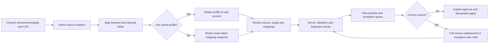

# Transactional product experience

Folio's product UI is organized around controlled accounting journeys rather than direct database
views. This document records repository-supported behavior and the remaining launch evidence; it is not
a WCAG certification or a substitute for controller usability validation.

## Journey coverage

| Daily journey                | Current product workflow                                                                                                                                  | Repository evidence                                                                       | Remaining acceptance evidence                                    |
| ---------------------------- | --------------------------------------------------------------------------------------------------------------------------------------------------------- | ----------------------------------------------------------------------------------------- | ---------------------------------------------------------------- |
| Identity and organization    | Authenticated setup/sign-in, role display, tenant-scoped workspace and sign-out                                                                           | `frontend/main.jsx`; auth and tenancy HTTP tests                                          | Session/device management and a manual assistive-technology pass |
| Journals                     | Guided balanced draft, evidence attachment and authorized posting                                                                                         | Journal UI, API authorization manifest and ledger tests                                   | Named maker-checker usability exercise                           |
| Revenue                      | Contract entry, billing, recognition, waterfall and GL reconciliation                                                                                     | Revenue UI and ASC 606 regression/property tests                                          | Representative controller walkthrough                            |
| Receivables                  | Payments, applications, credits, refunds, write-offs, disputes and collections                                                                            | Receivables UI and SaaS/operations tests                                                  | End-user task timing and high-volume queue evidence              |
| Imports                      | CSV/file source, downloadable template, mapping/profile review, paged validation, controlled apply, server-paged exceptions and linked correction/restage | `frontend/main.jsx`; `lib/imports.js`; import/API tests and rendered-browser verification | Launch-volume soak evidence and controller walkthrough           |
| Bank and close               | Statement controls, reconciliation exceptions, checklist and period lock                                                                                  | Bank/close UI and operations tests                                                        | Named close rehearsal with retained evidence                     |
| Investments and fixed assets | Guided lifecycle actions, rollforwards, disclosures and GL reconciliation                                                                                 | Module UIs and Topic regression tests                                                     | Controller validation against representative populations         |
| Reports and administration   | Statement exports plus users, policies, connector and fiscal configuration                                                                                | Reports/admin UI, route-policy tests and report tests                                     | Manual screen-reader review and customer role testing            |

## Import workbench flow

The browser never determines validity or authorization. Client suggestions only prepare the mapping;
the tenant repository re-parses the complete CSV, validates the mapping and template version, rejects
formula-like text and duplicates, and persists the effective mapping before returning a preview.

## Interaction and accessibility controls

- Dialogs announce a labeled modal title, move focus to its heading, trap forward/reverse tab movement,
  close on Escape, lock background scrolling and restore focus to the invoking control.
- Every form control has a visible or screen-reader-only label. Required mappings block progression;
  server errors and success results use live alert/status regions.
- Data tables use scoped column headers and contextual captions. Import batch and exception queues have
  explicit empty states, server-bounded pagination and user-controlled filtering.
- Blank versioned templates download from the source step. Correction preserves mappings when headers
  are unchanged, enforces complete source populations, and visibly links the replacement batch.
- Destructive or accounting-effective work remains outside the file/mapping dialog. Staging creates a
  review batch; application requires a separate authorized action after row validation.
- The workbench has been rendered without document overflow at 360, 768, 1280 and 1440 CSS pixels. The
  360-pixel layout uses a bottom-sheet dialog, stacked mappings and independently scrollable tables.
  The paged preview and correction loop were additionally exercised at 360 and 1280 CSS pixels.

## Unproven launch gates

Repository checks do not prove WCAG 2.2 AA conformance. Before pilot approval, retain a manual keyboard,
screen-reader and zoom report covering every primary journey, test contrast with an approved automated
tool, and record responsive screenshots at the exact release commit. Controller/CPA validation and
independent security testing remain separate required approvals under
[`production-acceptance.md`](production-acceptance.md).
